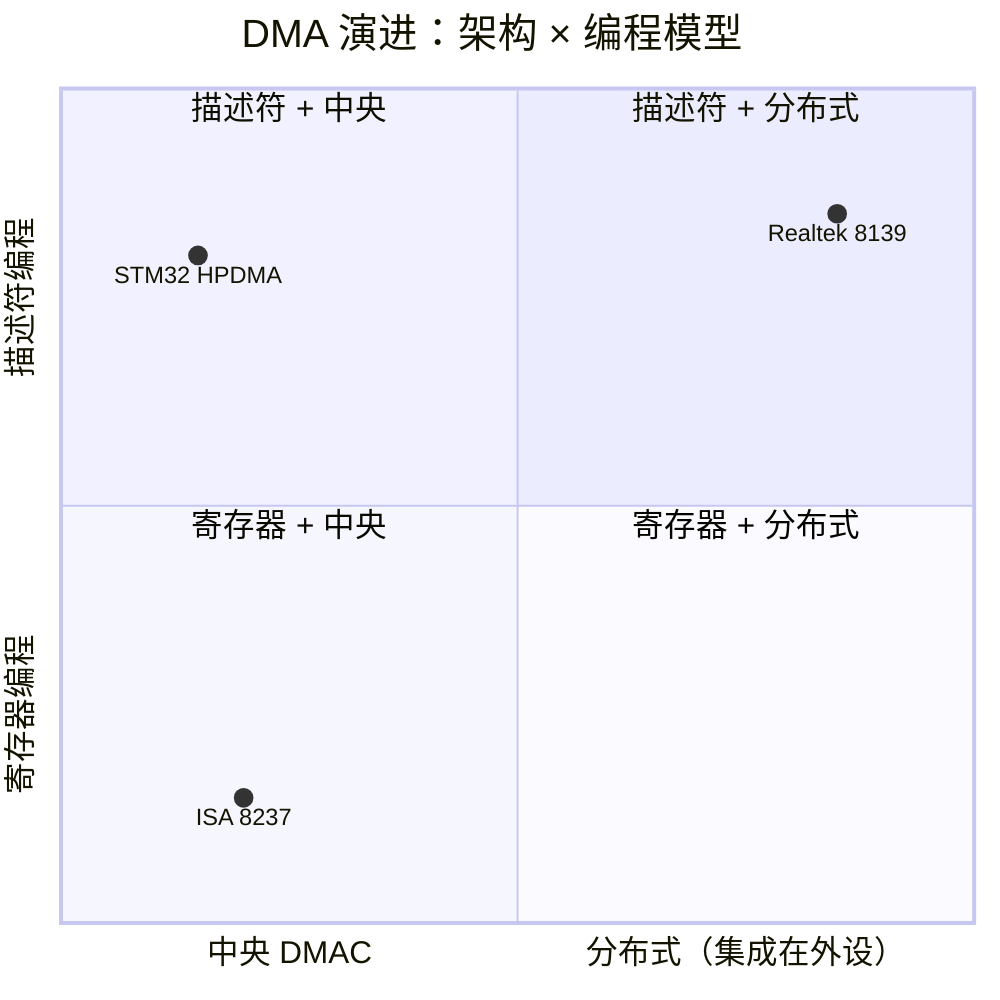

# Linux DMA 子系统 20 年演进史

> 为什么 dmaengine、dma-mapping、dma-buf、virt-dma 是今天这个样子？
>
> 每个数据结构背后都对应一个真实的历史问题。本文从 Linux v2.4 到 v6.6，沿着 DMA 子系统的关键节点，追溯**每个机制是在解决什么问题**。

---

## 1. 前传：DMA 是什么，早期 Linux 怎么做的（v2.4 之前）

### 1.1 DMA 是什么

DMA（Direct Memory Access，直接存储器访问）是一种**不经过 CPU、DMA 控制器直接在内存和外设之间搬运数据**的机制。

没有 DMA 的时代——即 **PIO（Programmed I/O，程序控制输入输出）** 模式——CPU 做每一笔数据传输都亲力亲为。CPU 从外设 FIFO 读一个字节、写一个字节到内存、再读下一个字节。计算机发展早期（1980 年代以前），外设速度与 CPU 速度相当，PIO 不算瓶颈。但一旦外设速度跟不上 CPU（打印机、磁盘驱动器的机械操作比 CPU 执行一条指令慢几个数量级），PIO 的问题就暴露了：CPU 花大量时间在"等"和"搬"上，真正该做的数据处理反而没时间做。

DMA 的硬件解决思路是：增加一个专门的硬件引擎——**DMA 控制器（DMAC）**，让它接管数据搬运工作。CPU 只需告诉 DMAC"从哪搬到哪、搬多少"，然后就可以去做别的任务。DMAC 独立地在总线上完成数据传输，传输结束后发一个中断通知 CPU。

```
PIO 模式（无 DMA）：
CPU: [读外设FIFO] → [写内存] → [读外设FIFO] → [写内存] → ...  100% 时间在搬运

DMA 模式：
CPU: [配置DMA] → (去处理其他任务)                     ← 只在开头结尾介入
DMA:              [读FIFO]→[写内存]→[读FIFO]→[写内存]→...[中断]→  CPU收尾
```

这个思路从 1950 年代的大型机时代就存在，但在 PC 和嵌入式领域，DMA 的硬件实现和软件接口经历了四个明显不同的阶段。理解这些阶段，才能理解 Linux 的 dmaengine 框架为什么设计成今天这样。

### 1.2 硬件阶段一：ISA DMA（1981~1990s）

PC 历史上第一个广泛使用的 DMA 控制器是 Intel 8237，出现在 1981 年的 IBM PC/XT 上。这是 4 通道（AT 扩展为两个级联的 8237，共 7 个可用通道）、8 位数据传输的 DMA 控制器，每个通道需要 CPU 单独编程。

#### 架构模型：中央式 DMA

ISA DMA 的本质模型是**"中央 DMAC 替外设搬数据"**。8237 集中管理所有 DMA 传输，外设自身没有 DMA 能力，只通过固定的硬件请求线发出请求：

```
 ISA 总线
┌────────────────────────────────────────────────┐
│                     CPU                         │
│         从 I/O 端口配置 8237 的寄存器            │
│         告诉它：源/目的地址、字节数、模式          │
└────────────────────┬───────────────────────────┘
                     │
┌────────────────────▼───────────────────────────┐
│          8237 DMA 控制器（南桥 / 芯片组内部）      │
│                                                  │
│     ┌─────┐  ┌─────┐  ┌─────┐  ┌─────┐         │
│     │CH0  │  │CH1  │  │CH2  │  │CH3  │         │
│     │     │  │     │  │     │  │     │         │
│     └──┬──┘  └──┬──┘  └──┬──┘  └──┬──┘         │
│        │        │        │        │             │
│     DRQ0/DACK0 DRQ1/DRQ2 DACK2   DRQ3/DACK3     │
└────────┼────────┼────────┼────────┼─────────────┘
         │        │        │        │
    ┌────┘   ┌────┘   ┌───┘   ┌────┘
    ▼        ▼        ▼       ▼
 ┌──────┐ ┌──────┐ ┌──────┐ ┌──────┐
 │DRAM   │ │软盘    │ │串口   │ │硬盘   │
 │刷新   │ │控制器  │ │       │ │(XT)   │
 │(保留)  │ │(ch2)  │ │(ch3)  │ │(ch3)  │
 └──────┘ └──────┘ └──────┘ └──────┘
```

**关键架构特点：**
- **中央集中**：一个 DMAC 服务所有外设，外设之间通过固定的硬件请求线（DRQ/DACK）区分
- **外设被动**：外设不管理传输参数，只负责发请求和回数据。传输地址、计数、方向全在 8237 内部寄存器中
- **总线主控倒手**：CPU 配置完 8237 后让出总线控制权，8237 作为总线主控执行传输，完成后交还

#### 8237 寄存器与 I/O 端口

每个通道由 4 个寄存器控制其传输参数：

| 寄存器 | 宽度 | 作用 |
|--------|------|------|
| 基地址寄存器（Base Address） | 16 位 | 传输起始的物理地址低 16 位 |
| 基字节数寄存器（Base Count） | 16 位 | 传输的字节数（硬件计数值 = 写入值 + 1） |
| 模式寄存器（Mode） | 8 位 | 读/写/校验方向、单次/块传输模式、自动初始化、地址递增/递减 |
| 页面寄存器（Page） | 8 位 | 地址 [19:16]（PC/XT 20 位）或 [23:16]（PC/AT 24 位） |

8237 主片（DMA controller #1）暴露给 CPU 的 I/O 端口空间：

| I/O 端口 | 读操作 | 写操作 |
|----------|--------|--------|
| 0x00 | 通道 0 基地址 (当前地址) | 通道 0 基地址 |
| 0x01 | 通道 0 基字节数 (当前计数) | 通道 0 基字节数 |
| 0x02 | 通道 1 基地址 | 通道 1 基地址 |
| 0x03 | 通道 1 基字节数 | 通道 1 基字节数 |
| 0x04 | 通道 2 基地址 | 通道 2 基地址 |
| 0x05 | 通道 2 基字节数 | 通道 2 基字节数 |
| 0x06 | 通道 3 基地址 | 通道 3 基地址 |
| 0x07 | 通道 3 基字节数 | 通道 3 基字节数 |
| 0x08 | 状态寄存器 | 命令寄存器 |
| 0x09 | — | 请求寄存器（软件触发 DMA） |
| 0x0A | — | 单通道屏蔽寄存器 |
| 0x0B | — | 模式寄存器 |
| 0x0C | — | 清除字节指针触发器 |
| 0x0D | — | 主清除（复位 8237） |
| 0x0E | — | 清除所有通道屏蔽 |
| 0x0F | — | 多通道屏蔽寄存器 |

页面寄存器分布（以 PC/AT 为例，将 16 位地址扩展为 24 位）：

| 页面寄存器端口 | 对应通道 |
|---------------|---------|
| 0x87 | 通道 0 |
| 0x83 | 通道 1 |
| 0x81 | 通道 2 |
| 0x82 | 通道 3 |
| 0x8B | 通道 5（从片） |
| 0x89 | 通道 6（从片） |
| 0x8A | 通道 7（从片） |

#### 四阶段传输流程

以一个完整的数据传输周期来看 8237 的工作方式——以软盘控制器（FDC）通过 ISA DMA 通道 2 读取一个扇区为例：

**Phase 1：CPU 配置 8237**

```
CPU → 写 8237 的 I/O 端口
  ① 模式 (port 0x0B) = 0x49 → 单字节读传输，地址递增
  ② 基地址 (port 0x04) = 0x1234 → 内存地址低 16 位
    页面 (port 0x81) = 0x00   → A16~A23 = 0x00
                                  物理地址 = 0x001234
  ③ 基字节数 (port 0x05) = 512 → 传输 512 字节
  ④ 单通道屏蔽 (port 0x0A) = 0x02 → 清除通道 2 屏蔽（即启动）
```

此时 8237 内部寄存器已装载完成，**CPU 不再介入**。

**Phase 2：CPU 触发外设**

```
CPU → 写软盘控制器数据端口 (0x3F5) = READ SECTOR 命令
```

**Phase 3：8237 自动执行传输（无 CPU 参与）**

```
① 软盘控制器内部 FIFO 收到一个字节的数据
② 软盘控制器通过 ISA 总线拉高 DRQ2 信号
③ 8237 检测到 DRQ2 有效：
   ├── 内部仲裁（固定优先级：通道 0 > 1 > 2 > 3）
   ├── 占用系统总线（向 CPU 发 HOLD 信号，CPU 响应 HLDA）
   └── 拉低 DACK2 信号通知软盘控制器：开始传输
④ 8237 从软盘控制器 FIFO 读一个字节（IOR 有效）
⑤ 8237 将字节写入内存地址 0x001234（IOW 有效）
⑥ 地址寄存器 += 1（下一字节地址 = 0x001235）
⑦ 字节计数器 -= 1
⑧ 8237 释放 DACK2 → 软盘控制器可以准备下一字节或撤消 DRQ
⑨ 8237 释放总线（撤消 HOLD）
⑩ 重复①~⑨，直到字节计数归零
⑪ 字节计数归零 → 8237 内部 TC（Terminal Count）置位 → 发 EOP 信号
⑫ 软盘控制器检测到传输完成 → 向 PIC 发 IRQ 6
```

**Phase 4：CPU 响应中断**

```
CPU 收到 IRQ 6
  ① 读软盘控制器状态寄存器 → 判断传输结果
  ② 访问 0x001234 获取扇区数据 → 提交给文件系统层
```

**单字节传输模式下的总线权交接开销：**

每个字节经历一次完整的 DRQ→仲裁→HOLD/HLDA→传输→释放 循环。以 8 MHz ISA 总线（125 ns/周期）估算，一次完整的单字节 DMA 传输约需 10~20 个总线周期（1.25~2.5 µs），其中仅数据传输占 1 个周期，**其余 90% 的开销在总线交接**。这就是块传输模式（Block Transfer Mode）出现的驱动力——一次 DRQ 连续传完整个块再释放总线，但受限于 8237 的 16 位计数器，块最大也只能到 64KB。

#### ISA DMA 的三个硬件天花板

这些限制不是设计缺陷，而是 1981 年硬件条件的自然产物。但它们对后续的 Linux DMA API 设计产生了深远影响：

**限制一：16MB 物理地址天花板**

8237 的地址寄存器 16 位（64KB 页内偏移）+ 页面寄存器 8 位（选择页）= 24 位地址空间。PC/XT 上 20 位（1MB），PC/AT 上 24 位（16MB）。这是物理硬件层的硬限制，软件无法绕过——传给 8237 的地址只有 24 根地址线。

这就是 Linux 内核中 `ZONE_DMA` 的历史根源。1990 年代，即使系统有 64MB 内存，必须预留低 16MB 给 ISA DMA buffer。这个区域直到今天仍存在于 x86 内核中（虽然含义已演变），是 ISA DMA 最长寿的软件遗产。

**限制二：单次传输最大 64KB**

基字节数寄存器 16 位，最大计数值 65535（硬件行为：每传输一字节计数器递减 1，从 0 跳变到 0xFFFF 时触发 TC）。实际传输字节数 = 写入值 + 1，最大 65536 字节。

> 细节：写入 0x0000 反而产生最大传输（65536 字节），因为计数器从 0 递减到 0xFFFF 才触发 TC。写入 0x0001 = 2 字节，0xFFFF = 65536 字节。

这个限制驱动了 SG（Scatter-Gather）概念的诞生——驱动将大数据切成多个 ≤64KB 的段，通过反复配置 8237 通道来传输。SG 后来演变为 Linux dmaengine 框架的核心数据抽象。

**限制三：总线权交接开销**

ISA DMA 的 DRQ→仲裁→HOLD/HLDA→传输→释放 流程在每次传输开始时都有固定开销。关键不在于性能损失，而在于延时不确定性。对于一个实时嵌入式系统（比如软盘控制器读取 FAT 表的目录项），ISA DMA 的单字节模式引入的额外延迟可能比实际数据传输还长。

PCI 总线引入后，这个问题以 **Bus Mastering（总线主控）** 的方式解决——PCI 设备自己就是总线主控，不需要 CPU 或中央 DMAC 让出总线。传输参数也改为放在内存中的描述符环里，设备自主取用。

#### 历史遗产：ISA DMA 今天还在影响什么

ISA DMA 的硬件已经在 2000 年代后的芯片组中消失，但它的软件遗产仍然无处不在：

| 遗产 | 来源 | 今天的表现 |
|------|------|-----------|
| **`ZONE_DMA`** | 16MB 物理地址天花板 | x86 仍保留低 16MB DMA 区域，ARM64 虽有 `ZONE_DMA` 但含义已变 |
| **SG（Scatter-Gather）** | 64KB 单次传输上限 | dmaengine 核心抽象 `dma_async_tx_descriptor` 内置 SG 链表支持 |
| **描述符链** | 克服 64KB 上限的切段方案 | `virt-dma` 框架的 `vchan_cookie_complete()` 链表管理可追溯到 ISA DMA 的页链 |
| **`dma_direct_*` 低地址回退** | 设备 DMA 能力有限时的应对策略 | `dma_alloc_coherent()` 在设备无 DMA mask 时回退低位内存的策略 |
| **设备树 `dma-ranges`** | 描述 DMA 地址窗口的需要 | 每个支持 DMA 的设备节点声明其可寻址的 DMA 地址空间 |
| **`GFP_DMA`** | 分配低 16MB 内存的需求 | slab 分配器中，`kmalloc(GFP_DMA)` 保证返回物理地址 < 16MB 的内存页 |

最根本的遗产其实是一个**思维模型**：ISA DMA 时代确立的"CPU 配置传输参数 → DMAC 执行 → 中断通知完成"的三段式流程，贯穿了从 8237 → PCI Bus Mastering → virt-dma → dmaengine 的整个演进过程。变化的只是参数存在哪（中央寄存器 → 外设寄存器 → 内存描述符环），以及谁是执行者（中央 DMAC → 外设自身 → 软件驱动的 DMA 引擎）。

### 1.3 硬件阶段二：PCI Bus Mastering DMA（1990s~2000s）

上世纪 80 年代 ISA DMA 的中央 DMAC 模型在 PC 兼容生态中运转了十年，但它有三个根本性的架构问题，随着外设增多和性能要求提升越来越难维持：

1. **通道数固定**：8237 只有 4 个通道（AT 级联后 7 个可用），ISA 插槽的 DRQ/DACK 线在 PCB 上硬连线绑定。用户多插一块 ISA 卡就可能遇到通道冲突。
2. **CPU 切换**：每次 DMA 传输都要经历 CPU 让出总线（HOLD/HLDA）→ 8237 执行 → CPU 收回总线 的完整交接。在多任务系统上，这个同步开销打乱了 CPU 的工作流水线。
3. **传输参数存在 8237 内部**：外设不能自己管理描述符，CPU 必须重新配置 8237 才能改变传输参数，无法支持复杂的链表传输。

1990 年代初 PCI 总线规范 1.0 发布，它引入了一个关键能力——**Bus Mastering（总线主控）**。

要理解 Bus Mastering 是什么，先搞清楚 ISA 时代的"中央 DMAC"是怎么回事。ISA 系统的 DMA 靠南桥里的 **8237 芯片** 完成。这是一颗**通用 DMA 控制器**——它不关心数据是什么，软盘来的字节、串口来的字节它都管。所有需要 DMA 的外设都接在它的 DRQ/DACK 线上，共用这一个芯片：

```
ISA 模型：一个通用 DMAC（8237）管所有外设的搬运
  软盘 ──DRQ2──┐
  串口 ──DRQ3──┼──→ 8237（通用 DMAC）──→ 内存
  声卡 ──DRQ1──┘     （谁拉 DRQ 就服务谁）
```

PCI 的做法完全不同。PCI 规范定义：**PCI 设备可以直接在总线上发起内存读写，不需要找 8237 帮忙。** 这个能力叫 Bus Mastering（总线主控）。外设内置的 PCI 接口本身就具备这个能力——当网卡收到数据包时，它的 PCI 接口逻辑直接产生 Memory Write 总线周期，把数据写到内存。

```
PCI 模型：每个设备用自己的 PCI 主控能力搬自己的数据
  网卡 ──→ 自身 PCI 接口（Bus Master）──→ 内存
  硬盘 ──→ 自身 PCI 接口（Bus Master）──→ 内存
  （各搬各的，没有公用的 DMAC）
```

**回答三个问题：**

1. **还有没有中央 DMAC？** PC 芯片组里为了兼容老 ISA 设备，8237 的逻辑仍然存在（集成在南桥里），但 **PCI 设备不用它**。PCI 设备走自己的 Bus Mastering 路径。

2. **中央 DMAC 是不是通用 DMA？** 是。8237 是通用 DMA 控制器——它不绑定特定外设，谁接在它的通道上它就服务谁，通道可以重新分配。

3. **PCI 主控 DMA 又是啥？** 它不是一颗芯片，也不是一个"引擎"。它是 PCI 协议定义的一种能力：**一个 PCI 设备可以作为总线主控发起读写事务**。这个能力由设备内的 PCI 接口电路实现，只服务自己，不能给别人用。

> **关键理解：这还叫 DMA 吗？**
>
> DMA 的全称是 **Direct Memory Access（直接存储器访问）**，字面意思就是"数据直接进出内存，不经过 CPU"。这个定义只描述了**效果**（CPU 没搬数据），没限定**怎么实现**。
>
> ISA 时代，"DMA 控制器"这个说法很自然——因为那时 DMA 确实需要一颗独立的 8237 芯片来完成。但 PCI Bus Mastering 做到了同样的效果：数据从网卡 FIFO 到内存，整条路径上 CPU 没有碰过一个字节。所以 **Bus Mastering 是 DMA 的一种实现方式，而不是 DMA 的替代品。**
>
> | 方式 | 谁在执行搬运 | CPU 搬数据了吗？ | 是不是 DMA？ |
> |------|------------|----------------|-------------|
> | PIO（CPU 逐字节搬） | CPU | ✅ 搬了 | ❌ |
> | ISA DMA（配 8237） | 8237 芯片 | ❌ 没搬 | ✅ |
> | PCI Bus Mastering（配网卡） | 网卡的 PCI 主控逻辑 | ❌ 没搬 | ✅ |
>
> 两个都是"CPU 没搬"，都是 DMA。区别只在**"谁替 CPU 搬"**：ISA 是一个公用芯片（8237）替所有外设搬；PCI 是每个外设用自己的主控接口替 CPU 搬。

两种模型的本质区别：**ISA 是"一个公用 DMAC 替所有外设搬"；PCI 是"每个外设用自己的 PCI 接口自己搬"。**

下面以 Realtek 8139 网卡为例，看 PCI 设备怎么做 DMA。

#### PCI 网卡自己做 DMA

现在看一个 PCI 设备自己做 DMA 的例子。以 Realtek 8139 网卡（1990 年代末最常见的 PCI 以太网卡）为例，它接收一个网络包的过程：

**芯片级视角：**

```
Realtek 8139 (单芯片 PCI 以太网控制器):
┌─────────────────────────────────────────────────┐
│  PCI 接口 (符合 PCI 规范 v2.2, 支持 Bus Master)  │
│                                                  │
│  硬件能力：可作为总线主控直接发起                  │
│  ─ PCI Memory Write（从设备写内存）               │
│  ─ PCI Memory Read （从内存读数据到设备）         │
│                                                  │
│  通过 BAR0 暴露 MMIO 空间 (0xE8000000, 256B):    │
│    0x00: RBSTART (接收描述符环基地址)             │
│    0x04: CAPR (当前读取指针)                      │
│    0x08: CBR (接收字节数计数器)                    │
│    0x0C: IMP (丢包计数器)                         │
│    0x30: IMR/ISR (中断掩码 / 中断状态寄存器)      │
│                                                  │
│  注意：Bus Mastering 是 PCI 协议能力，不是独立     │
│  的 DMA 引擎。8139 的功能逻辑（MAC 收到包后 →    │
│  FIFO 有数据）通知 PCI 接口 → PCI 接口作为        │
│  总线主控发 Memory Write 写数据到内存。            │
│                                                  │
│  ┌──────────────────────────────────────────┐    │
│  │ 以太网 MAC + PHY (收发网络包)            │    │
│  └──────────────────────────────────────────┘    │
└─────────────────────────────────────────────────┘
```

> **重申**：Bus Mastering 是 PCI 协议能力，不是独立 DMA 芯片。8139 的 PCI 接口自带的这个能力只服务自己，不给别的设备用。

**接收一个数据包的完整 DMA 流程：**

```
① 初始化（驱动加载时）:

   CPU 分配一块较大的连续内存作为接收环：
     rx_ring = dma_alloc_coherent(dev, 65536, &rx_ring_dma, GFP_KERNEL)
     // rx_ring_dma 是物理地址，网卡将向这个环形区域写数据
     // 65536 字节的环足够容纳几十个网包

② CPU 配置网卡（通过 BAR0 的 MMIO 寄存器）:

   writel(NIC_BAR0 + 0x00, rx_ring_dma)    // RBSTART = 环基地址
   writel(NIC_BAR0 + 0x0C, 65536)          // 环大小
   writel(NIC_BAR0 + 0x30, RX_ENABLE)      // 使能接收
   // CPU 的配置工作到此结束。网卡知道自己往哪个地址范围写数据

③ 网卡自主收包（没有 CPU 介入）:

   当网络上有包到达 8139 的 PHY → MAC 校验通过 → 完整包在网卡内部 FIFO 就绪

   网卡 PCI 接口作为总线主控做的事情（全硬件自动）:
     ① 发起 PCI Memory Write 事务：
          地址线 = rx_ring_dma + 当前写入偏移（网卡内部维护写指针）
          数据线 = 从内部 FIFO 逐字节读出的数据
        → rx_ring_dma 对应的物理内存被写入第一个包

     ② 网卡内部写指针向后移动（+= 包长度 + 描述头 4 字节）
        网卡内部计数器 CBR（收包字节数）累加

     ③ 第二个包到达 → 同样过程：
        地址线 = rx_ring_dma + 新的写入偏移
        写到连续的下一个位置

     ④ 网卡内部更新 ISR 寄存器: ISR.ROK = 1  // 接收完成标志

     ⑤ 网卡向 PIC（中断控制器）发 IRQ 信号

④ CPU 响应中断（中断 handler 中）:

   CPU 收到 IRQ → 读 ISR → 发现 ROK=1

    ① 读 CAPR 寄存器（当前读取指针），算出第一个包在环中的位置
    ② process_packet(rx_ring + offset_1, length_1)

       注意：CPU 读的是 rx_ring（dma_alloc_coherent 返回的虚拟地址），
       就是刚才网卡通过 PCI 总线物理地址 rx_ring_dma 写入的那块内存。
       因为 coherent 映射保证 cache 一致性，CPU 读到的就是网卡刚写的数据。

    ③ 更新 CAPR 寄存器：
       writel(NIC_BAR0 + 0x04, 新读取位置)
       // 告诉网卡：CPU 已经处理到这个地方了，环中这部分可以重用

    ④ process_packet(rx_ring + offset_2, length_2)  // 处理第二个包
       更新 CAPR

   // 网卡继续往环中空闲区域写新收到的包，不需要 CPU 重新配置
```

对比 ISA DMA 的流程来理解区别：

| | ISA DMA（8237） | PCI Bus Mastering（8139） |
|--|----------------|--------------------------|
| 谁执行数据搬运 | 南桥芯片内部的中央 DMAC（8237） | 网卡的 PCI 总线主控逻辑 |
| CPU 跟谁打交道 | 8237 的 I/O 端口 + 外设各自端口 | 网卡的 BAR 寄存器（MMIO） |
| 传输参数存在哪 | 8237 的寄存器（基地址+字节数+模式） | 内存中的描述符/网卡内部寄存器 |
| 谁发起读写 | 8237 作为总线主控 | 网卡作为总线主控 |
| 谁发中断 | 外设（软盘控制器→IRQ6） | 网卡（PCI INTx 或 MSI） |

**核心区别一句话：ISA DMA 是"中央 DMAC 替外设搬"，PCI Bus Mastering 是"外设自己搬"。**

#### Bus Mastering 对软件架构的深远影响

回到 CPU 的视角：**CPU 怎么做到"配置完就不管了"？**

关键在于 CPU 控制外设的方式变了。ISA 时代 CPU 直接配置 DMAC 的寄存器告诉它搬什么。PCI Bus Mastering 时代 CPU 配置的是外设的寄存器（通过 BAR 的 MMIO 空间），告诉外设"你的描述符在哪"，然后外设自己读描述符、自己执行传输。

**描述符驱动模式的诞生。** ISA 时代 CPU 通过 8237 的寄存器逐字段告诉 DMAC"搬什么"——地址、计数、方向全在 I/O 端口里。PCI Bus Mastering 把这个"任务描述"从寄存器搬到了内存中：CPU 在内存里排好一个描述符环（也叫描述符表），告诉外设"你的任务列表在这里"，外设自己去读和执行。

8139 网卡的接收环就是这种模式——RBSTART 指向内存中的环，网卡自行遍历。这个**描述符驱动**的编程模型比寄存器级别的配置更灵活：描述符可以组成链表，支持更复杂的传输序列。

但要注意：**描述符模型 ≠ 分布式架构**。8139 把描述符能力和 DMA 能力都集成在网卡内部；而在嵌入式 SoC 中，经常看到另一种组合——中央 DMAC + 描述符。比如 STM32MP257 的 HPDMA：

```c
// STM32MP257 HPDMA 的 LLI（Linked List Item）描述符
struct stm32_dma3_lli {
    u32 ctr1;    // 传输控制 1：数据宽度、burst 大小、FIFO 阈值
    u32 ctr2;    // 传输控制 2：传输模式、交换模式（SINC/DINC）
    u32 cbr1;    // 块长度寄存器 1：传输字节数
    u32 csar;    // 源地址寄存器（CSAR）：从哪读
    u32 cdar;    // 目标地址寄存器（CDAR）：写到哪
    u32 cllr;    // 链表寄存器（CLLR）：下一段 LLI 的地址，NULL 表示最后一段
};

// CPU 排好链表：
struct stm32_dma3_lli lli[2] = {
    { .csar = SPI_FIFO_ADDR, .cdar = buf_A_phys, .cbr1 = 256, .cllr = &lli[1] },
    { .csar = SPI_FIFO_ADDR, .cdar = buf_B_phys, .cbr1 = 256, .cllr = NULL },
};
// 写 CLLR 寄存器指向链表头，写 CCR.EN=1 → HPDMA 开始自行遍历链表
// HPDMA 做的工作：读 lli[0]→搬 256 字节→读 CLLR→读 lli[1]→搬 256 字节→结束发中断
```

HPDMA 的编程模型继承自 PCI 的描述符驱动模式（在内存中建任务列表，硬件自动取用），但它的**架构归属**不同：



**总结：** 从 ISA 到 PCI，有两个独立的演进方向——**架构上**从中央走向分布式（DMA 控制权下放到外设）；**编程模型上**从寄存器走向描述符（任务描述从 I/O 端口搬到内存）。HPDMA 是这两个演进方向的交叉产物：架构继承 ISA（中央 DMAC），编程模型继承 PCI（描述符）。

### 1.4 硬件阶段三：嵌入式 SoC 内部的 DMA（2000s~至今）

ARM 在 2000 年代进入 SoC 市场后，DMA 控制器的设计呈现两个趋势：

**趋势一：DMA 从中央外设变为层次化结构。** 早期 SoC（如 ARM9 时代的 PL080/PL081 DMAC）仍沿用"中央 DMA 控制器 + 请求线"模式——每个外设有一条专用的 DMA 请求线连到 DMAC，DMAC 判断哪个请求优先，然后执行传输。随着 SoC 外设数量爆炸，这种点对点布线不现实了。于是出现了 **DMA 路由器**（如 STM32 的 DMAMUX、TI 的 crossbar）——外设请求统一送往 MUX，MUX 按配置路由到有限的 DMA 通道。

**趋势二：DMA 从简单搬运变为智能处理。** 现代 DMA 控制器（STM32 DMA3、NXP eDMA、TI PKTDMA）的特征：

| 特性 | ISA 8237 | PL080 (ARM) | STM32 DMA3 |
|------|----------|-------------|------------|
| 通道数 | 4 | 8 | 16/实例 × 3 |
| 地址宽度 | 24 位 | 32 位 | 32 位 |
| 描述符 | 无（寄存器设置） | 简单链表 | LLI（linked-list，硬件预取） |
| 传输模式 | 单次 | 单次/自动 | SG/Cyclic/重复 |
| 数据宽度 | 8 位 | 8/16/32 位 | 8/16/32/64/128 位 |
| 总线接口 | ISA | AHB | AXI（多主端口） |
| MUX | 无 | 无 | DMAMUX |

回头看 1981 年的 8237 和 2024 年的 STM32 DMA3，本质解决的问题相同——"从 A 搬到 B，别打扰 CPU"——但复杂度来自三个维度：

1. **地址空间变大了**：从 24 位（16MB）到 64 位（16EB），DMA API 需要支持任意地址范围
2. **总线拓扑复杂了**：从单总线到多层 AXI 互连，同一笔 DMA 可能穿越多个桥接器
3. **外设数量爆炸了**：从几个 ISA 设备到几十个 SoC 内设，需要 MUX 管理和通道复用

这些硬件演化**直接塑造了 Linux DMA 子系统的软件架构**——我们在后面的章节中会逐一看到，每个关键数据结构的设计背后都有对应的硬件问题。

### 1.5 DMA 的核心矛盾：CPU 和 DMA 共享内存时谁说了算

DMA 的本质问题是**共享内存的并发访问**。CPU 和 DMA 控制器从两个不同的路径访问同一片物理内存。在没有复杂 cache 一致性的年代（386/486），这还不是大问题——CPU 直接读写内存芯片，DMA 也直接读写内存芯片，双方看到的是同一个物理存储。但现代 CPU 在 CPU 和内存之间加了多级 cache（L1/L2/L3），而 DMA 控制器通常不经过 cache。于是出现了一个经典的不一致问题：

```
步骤 1：CPU 执行 mov r0, [buffer]  → cache 命中，buffer 数据在 cache 中更新
步骤 2：CPU 配置 DMA 把外设数据搬到 buffer
步骤 3：DMA 直接写物理内存 → 物理内存中有新数据
步骤 4：CPU 再次读 buffer  → cache 命中！！！读到的是步骤 1 的旧数据，而不是 DMA 刚写的新数据
```

解决这个矛盾有两条路径：

**路径 A：硬件保证一致性（硬件 coherency）。** CPU 和 DMA 控制器通过同一套一致性协议（ARM ACE/CHI、x86 MESIF）访问内存。DMA 写内存时，cache 控制器自动将对应的 cache line 失效；DMA 读内存时，cache 控制器自动回写脏数据。最彻底的方案是 ARM 的 **CCI（Cache Coherent Interconnect）** 或 **DSU（DynamIQ Shared Unit）**——DMA 事务和 CPU 事务在互连层面统一做一致性管理。硬件代价高（额外的 snoop 滤波器、一致性协议逻辑）。

**路径 B：软件维护一致性（软件管理）。** 没有硬件一致性支持时，内核必须用 cache 维护指令手动同步。ARM64 上就是 `dc cvac`（Clean Virtual Address to Point of Coherency，写回 cache line）和 `dc civac`（Clean & Invalidate，写回并失效）。软件路径是 Linux dma-mapping API 的基础——`dma_sync_*` 系列函数最终都会落到这几条架构特定的 cache 指令上。

多数嵌入式 SoC（包括 STM32MP257）走的是路径 B——AXI 总线没有一致性协议支持，DMA 和 CPU 看到的数据可能不一致，需要软件干预。这是 dma-mapping API 区分 coherent mapping 和 streaming mapping 的根本原因。

### 1.6 三种地址：CPU 看到的、内存实际在哪的、DMA 设备能访问的

在深入早期 DMA API 之前，必须先搞清楚一个基本概念：一次 DMA 传输中涉及**三个完全不同的地址空间**。

以 STM32MP257 为例：CPU 执行指令 `mov r0, [0xffffff8000100040]` 时，这个 `0xffffff8000100040` 是 CPU 通过 MMU（内存管理单元）看到的一个**虚拟地址**。MMU 查页表发现这个虚拟地址对应物理地址 `0x100040`，于是在物理内存的第 `0x100040` 字节处读写数据。

与此并行的是，SPI 控制器配置好 HPDMA 寄存器后，HPDMA 引擎直接连在 AXI 总线上。它不经过 MMU，它看到的是**AXI 总线地址空间**——在这个 SoC 上，`0x100040` 这个地址同样能访问到物理内存的第 `0x100040` 字节（直接映射）。但对某些 DMA 控制器来说，它只能访问 `0xc0000000~0xffffffff` 这个范围的地址。

```
CPU 视角（虚拟地址）            MMU 页表             物理地址/DMA 地址（STM32MP257 HPDMA 直接映射）
┌───────────────────┐         ┌──────────┐         ┌────────────────────┐
│ 0xffffff8000100040│ ──────→ │ 翻译    │ ──────→ │ 0x0000000000100040 │
│ (MMU 虚拟地址)    │         └──────────┘         │ (物理内存位置)      │
│                   │                              │                    │
│                   │                          DMA 控制器(STM32 HPDMA) │
│                   │                              │ 看到同样的地址空间   │
└───────────────────┘                              └────────────────────┘
```

归纳为三个明确的术语：

| 术语 | 英文 | 谁在用 | 含义 |
|------|------|--------|------|
| **虚拟地址** | Virtual Address | CPU (MMU 使能后) | CPU 指令中使用的地址，经 MMU 页表转换为物理地址 |
| **物理地址** | Physical Address | 内存控制器、MMU | 物理内存芯片上的真实位置 |
| **总线/DMA 地址** | Bus/DMA Address | DMA 控制器、外设 | 设备在总线上看到的地址空间。有 IOMMU/SMMU 时与物理地址不同，无 IOMMU 时等于物理地址 |

这三个地址在嵌入式系统上的典型关系：

```
CPU (虚拟地址)                MMU                 Physical Memory
 0xffffff8000100040 ──→ 页表:[VA→PA] ──→  0x100040 (物理地址)
                                            ↑
DMA 控制器 (HPDMA) ─────────────────────────┘
 写 CDAR=0x100040                           ↑
                                            |  (DMA 地址 = 物理地址,
                                            |   因为 HPDMA 直连 AXI，
                                            |   无 SMMU 做地址翻译)
```

关键结论：**DMA 设备不经过 MMU**。它直接访问物理地址空间。如果 SoC 有 SMMU（System MMU，如 ARM MMU-600），DMA 设备看到的总线地址可以被 SMMU 翻译成物理地址——这时 DMA 地址 ≠ 物理地址。STM32MP257 的 HPDMA 直连 AXI 总线，没有 SMMU，DMA 地址就等于物理地址。

这个区别直接贯穿整个 DMA API 的设计——`dma_alloc_coherent()` 返回两个值：`cpu_addr`（给 CPU 访问的虚拟地址）和 `dma_handle`（给 DMA 控制器编程的总线地址）。驱动必须同时使用这两个地址，缺一不可。

### 1.3 早期 DMA 接口的混乱

明确三种地址的区分后，再看早期 Linux 的 DMA 接口就知道问题出在哪了。

Linux v2.4 及之前，内核没有一个统一的 DMA API。DMA 相关操作分散在各架构的实现中。

**`virt_to_bus()` 的问题**：

```c
/* 早期 x86 上的 DMA：假设虚拟地址 - 偏移 = 总线地址 */
unsigned long virt_to_bus(volatile void *address);
void *bus_to_virt(unsigned long address);
```

这个函数在 x86 早期 PC 上确实能工作——因为在没有 IOMMU 的 x86 上，物理地址 = 总线地址，而线性映射区中虚拟地址 = 物理地址 + 固定偏移（PAGE_OFFSET）。所以 `virt_to_bus(vaddr)` = `vaddr - PAGE_OFFSET` = 物理地址 = 总线地址。

但在 ARM 上，这个假设立刻失效：
- MMU 开启后，CPU 看到的是虚拟地址，需要查页表才能得到物理地址
- 并非所有虚拟地址都有线性映射关系（vmalloc、ioremap 的区域就是动态映射的）
- DMA 设备可能只能访问特定范围的物理地址（比如某些 SoC 上只有低 32MB 是 DMA 可访问的）

所以 ARM 早期实现不得不自己维护一套 DMA 地址转换：

```c
/* ARM 早期 DMA 地址转换 */
dma_addr_t __virt_to_dma(struct device *dev, void *addr);
void *__dma_to_virt(struct device *dev, dma_addr_t addr);
```

**PCI 专属的 DMA API**：即使不依赖 `virt_to_bus`，v2.4 的 DMA API 也是通过 PCI 总线接口暴露的——非 PCI 设备无法使用：

```c
#include <linux/pci.h>

/* 一致性映射 */
void *pci_alloc_consistent(struct pci_dev *pdev, size_t size,
                           dma_addr_t *dma_handle);

/* 流式映射 */
dma_addr_t pci_map_single(struct pci_dev *pdev, void *ptr,
                          size_t size, int direction);

/* Cache 同步 */
void pci_dma_sync_single(struct pci_dev *pdev, dma_addr_t dma_handle,
                         size_t size, int direction);
```

对于没有 PCI 总线的嵌入式设备（ARM AMBA/AXI 总线、PowerPC 的 local bus），驱动开发者只能用架构特定的 DMA API 或直接操作寄存器。以 v2.4 中的 ARM 平台为例，DMA 操作通过 `arch/arm/mach-*/dma.c` 中的架构专用函数完成——每个 SoC 的实现都不同，驱动没有跨平台移植的可能。

`virt_to_bus()` 最终被标记为 `__deprecated`，内核文档 `Documentation/DMA-API-HOWTO.txt` 直言：

> Drivers converted fully to this interface should not use virt_to_bus() any longer, nor should they use bus_to_virt().

**PCI 专属的 DMA API**：Linux v2.4 中，DMA API 是通过 PCI 总线接口暴露的：

```c
#include <linux/pci.h>

/* 一致性映射 — 分配并映射 DMA buffer */
void *pci_alloc_consistent(struct pci_dev *pdev, size_t size,
                           dma_addr_t *dma_handle);

/* 流式映射 — 映射已有 buffer 给 DMA 使用 */
dma_addr_t pci_map_single(struct pci_dev *pdev, void *ptr,
                          size_t size, int direction);

/* Cache 同步 */
void pci_dma_sync_single(struct pci_dev *pdev, dma_addr_t dma_handle,
                         size_t size, int direction);
```

这些函数只在 PCI 总线上可用。对于嵌入式设备（通常没有 PCI 总线，而是 AMBA/AXI 等 SoC 内部总线），驱动开发者要么使用架构特定的 DMA API，要么自己直接操作 DMA 控制器寄存器。以 v2.4 中的 ARM 平台为例，DMA 操作通常通过 `arch/arm/mach-*/dma.c` 中的架构专用函数完成——每个 SoC 的 DMA 驱动实现完全不同，没有跨 SoC 移植的可能。

**没有标准 DMA 控制器的框架**：即使解决了 buffer 映射问题，驱动开发者还需要自己管理 DMA 硬件控制器的整个生命周期——分配通道、建立描述符、处理中断、管理完成队列。每个 DMA 控制器的驱动都在重复造轮子：sa11x0 有自己的描述符链表管理，pxa 有自己的 DMA 描述符池，davinci 有另一套实现。这些驱动之间没有共享任何代码。

**需要解决两个根本问题**：

| 问题 | 描述 | 解决方案 |
|------|------|---------|
| **buffer 映射** | 驱动需要把 CPU 看的虚拟地址转成 DMA 设备能访问的总线地址，还要处理 cache 一致性 | 通用 DMA API（dma-mapping） |
| **传输编排** | 驱动需要分配通道、建立描述符、提交传输、处理完成中断——每个 DMA 控制器的管理方式不同 | dmaengine 框架 |

这两个问题的解决方案是在不同时间线分别演进的，我们按时间顺序展开。

---

## 2. 第一次统一：通用 DMA API（v2.5.53, 2002）

### 2.1 背景：非 PCI 设备的呼声

2002 年，Linux 内核中 PCI 仍是绝对的主流总线。但嵌入式设备（ARM、PowerPC、SuperH）迫切需要一套不依赖 PCI 的 DMA API。来自 IBM 的 James Bottomley 提交了通用设备 DMA API 的实现，其出发点从补丁描述中可以看得很清楚：

> Implements the generic device dma API via the existing pci_ one for unconverted architectures.

这套 API 的设计分两大部分：

**Part I — 基础 API（对应 PCI API 的通用化）**：

```c
#include <linux/dma-mapping.h>

/* 一致性映射 */
void *dma_alloc_coherent(struct device *dev, size_t size,
                         dma_addr_t *dma_handle, gfp_t flag);
void dma_free_coherent(struct device *dev, size_t size,
                       void *cpu_addr, dma_addr_t dma_handle);

/* 流式映射 */
dma_addr_t dma_map_single(struct device *dev, void *cpu_addr,
                          size_t size, enum dma_data_direction dir);
void dma_unmap_single(struct device *dev, dma_addr_t dma_addr,
                      size_t size, enum dma_data_direction dir);

/* 流式映射（SG 版本） */
int dma_map_sg(struct device *dev, struct scatterlist *sg,
               int nents, enum dma_data_direction dir);
void dma_unmap_sg(struct device *dev, struct scatterlist *sg,
                  int nents, enum dma_data_direction dir);

/* Cache 同步 */
void dma_sync_single_for_cpu(struct device *dev, dma_addr_t dma_handle,
                             size_t size, enum dma_data_direction dir);
void dma_sync_single_for_device(struct device *dev, dma_addr_t dma_handle,
                                size_t size, enum dma_data_direction dir);

/* DMA 掩码 */
int dma_set_mask(struct device *dev, u64 mask);
```

**Part II — 非一致性平台的扩展**：支持那些没有硬件 cache 一致性保证的架构（早期的 ARM、MIPS 等）。这些架构上 DMA 和 CPU 看到的内存可能不同（CPU 有 cache，DMA 直接读写内存），需要手动维护 cache 一致性。

这套 API 的设计特点是**总线无关**。驱动开发者只需传 `struct device *`，不再需要关心底层是 PCI、ISA 还是 SoC 内部总线。各架构通过实现 `dma_map_ops` 虚函数表来提供具体实现：

```c
/* 架构需要实现的 dma_map_ops */
struct dma_map_ops {
    void *(*alloc)(struct device *dev, size_t size,
                   dma_addr_t *dma_handle, gfp_t gfp,
                   unsigned long attrs);
    void (*free)(struct device *dev, size_t size,
                 void *vaddr, dma_addr_t dma_handle,
                 unsigned long attrs);
    dma_addr_t (*map_page)(struct device *dev, struct page *page,
                           unsigned long offset, size_t size,
                           enum dma_data_direction dir,
                           unsigned long attrs);
    int (*map_sg)(struct device *dev, struct scatterlist *sg,
                  int nents, enum dma_data_direction dir,
                  unsigned long attrs);
    void (*sync_single_for_cpu)(struct device *dev,
                                dma_addr_t dma_handle, size_t size,
                                enum dma_data_direction dir);
    ...
};
```

通用 DMA API 的引入是 DMA 子系统演进的**第一次统一**。但它只解决了"buffer 映射"问题——驱动开发者现在可以轻松地将一个内存 buffer 映射为 DMA 可访问的地址。**传输编排（怎么用 DMA 控制器实际做搬运）仍然需要驱动自己实现。**

### 2.2 两个核心选择：coherent vs streaming

通用 DMA API 中最重要的设计决策是**一致性映射**和**流式映射**的分离。这个分离直接对应 DMA 使用的两种场景：

**一致性映射（coherent mapping）**：

```c
/* 分配一段 CPU 和 DMA 都能同时访问的内存 */
cpu_ptr = dma_alloc_coherent(dev, size, &dma_handle, GFP_KERNEL);
// 分配后，CPU 写 cpu_ptr，DMA 读 dma_handle，双方总是看到一致的数据
// 不需要调用 dma_sync_*()——硬件保证一致性
```

一致性映射适合以下场景：
- DMA 描述符环（descriptor ring）—— CPU 和 DMA 控制器频繁同时读写
- 音频 DMA buffer——CPU 写入音频数据、DMA 读取发往 I2S
- 网络 DMA —— DMA 写入接收数据、CPU 读取

硬件上，`dma_alloc_coherent()` 在 ARM64 上通过页表属性将页面标记为 Normal Non-Cacheable（使用 MAIR_EL1 中的属性索引），这样 CPU 访问该页面时不经过 cache，直接读写内存。代价是访问延迟增加（cache 缺失的延迟）。

**流式映射（streaming mapping）**：

```c
/* 映射已有的 buffer（通常来自 kmalloc、栈、页缓存）给 DMA 使用 */
dma_addr_t dma_handle = dma_map_single(dev, cpu_buf, size, DMA_TO_DEVICE);
// 映射后，DMA 端拥有 buffer，CPU 不能访问
// 传输完成后：
dma_unmap_single(dev, dma_handle, size, DMA_TO_DEVICE);
// 或：dma_sync_single_for_cpu(dev, dma_handle, size, DMA_FROM_DEVICE);
```

流式映射适合以下场景：
- 网络收发 buffer——从 `alloc_skb()` 得到的 buffer，映射后交给 DMA 传输
- 块设备 I/O buffer——从页缓存来的数据
- 单次 SPI 传输 buffer——传输完成后不再需要

流式映射的 cache 维护路径（ARM64 为例）：
```
dma_map_single(dev, addr, size, DMA_TO_DEVICE)
  → dma_direct_map_page(dev, page, offset, size, dir, attrs)
    → arch_sync_dma_for_device(phys_addr, size, dir)
      → __clean_dcache_area_poc(phys_to_virt(phys_addr), size)
        // ARM64 上发出 dc cvac 指令：清理 cache 到 PoC（Point of Coherency）
        // 保证 CPU 写的 cache 数据被刷回内存，DMA 才能读到正确数据

dma_unmap_single(dev, addr, size, DMA_FROM_DEVICE)
  → dma_direct_unmap_page(dev, addr, size, dir, attrs)
    → arch_sync_dma_for_cpu(phys_addr, size, dir)
      → __inv_dcache_area_poc(phys_to_virt(phys_addr), size)
        // ARM64 上发出 dc civac 指令：清理 + 失效 cache
        // 保证下次 CPU 读时去内存拿最新数据（DMA 刚写进去的）
```

两个映射类型的核心区别归结为一句话：**一致性映射牺牲延迟换取免维护，流式映射用 cache 命中率换性能但需要手动同步。**

---

## 3. dmaengine：DMA 控制器框架诞生（v2.6.18, 2006）

### 3.1 为什么需要 dmaengine

2006 年之前，Linux 内核**有能力驱动 DMA 控制器硬件，但没有框架来管理它们**。Intel 的 I/O Acceleration Technology（I/OAT）是推动 dmaengine 诞生的直接动力。I/OAT 是一组集成了 DMA 引擎的芯片组功能，可以卸载 TCP 数据拷贝、RAID 校验计算等操作。Intel 需要内核提供一个标准框架来暴露这些硬件能力。

2006 年 3 月，Chris Leech 提交了第一版 dmaengine 补丁：

```
[PATCH 1/9] [I/OAT] DMA memcpy subsystem

 drivers/Kconfig           |    2
 drivers/Makefile          |    1
 drivers/dma/Kconfig       |   13 +
 drivers/dma/Makefile      |    1
 drivers/dma/dmaengine.c   |  405 ++++++++++++++++++++++++++++++++
 include/linux/dmaengine.h |  337 +++++++++++++++++++++++++++
 6 files changed, 759 insertions(+)
```

初始版本的设计非常精简——核心就是两个结构体和一个注册机制：

```c
/* 一个 DMA 控制器 */
struct dma_device {
    unsigned int chancnt;
    struct list_head channels;           /* 通道列表 */
    struct list_head global_node;

    struct dma_async_tx_descriptor *(*device_prep_dma_memcpy)(
        struct dma_chan *chan, dma_addr_t dst, dma_addr_t src,
        size_t len, unsigned long flags);
    void (*device_issue_pending)(struct dma_chan *chan);
    enum dma_status (*device_tx_status)(struct dma_chan *chan,
                                        dma_cookie_t cookie,
                                        struct dma_tx_state *txstate);
};

/* 一个 DMA 通道 */
struct dma_chan {
    struct dma_device *device;
    dma_cookie_t cookie;
    struct list_head global_node;
    struct list_head client_node;
    struct dma_client *client;
};

/* 传输描述符 */
struct dma_async_tx_descriptor {
    dma_cookie_t cookie;
    dma_async_tx_callback callback;
    void *callback_param;
    struct dma_chan *chan;
};
```

设计意图很明确：dmaengine 定位为**异步内存拷贝的硬件卸载框架**——"DMA engines offload copy operations from the CPU to dedicated hardware, allowing the copies to happen asynchronously."（`drivers/dma/Kconfig`）。初始版本只支持 `DMA_MEMCPY` 一种操作类型。

### 3.2 dma_client 模型（已被淘汰）

早期的 dmaengine 使用 **dma_client** 模型分配通道：

```c
struct dma_client {
    struct list_head channels;            /* 当前分配给这个 client 的通道 */
    dma_cap_mask_t cap_mask;              /* 需要的能力 */
    void (*event_callback)(struct dma_client *client,
                           struct dma_chan *chan,
                           enum dma_event_type event);
};
```

工作流程是：
1. `dma_async_client_register(client)`——注册 client 到框架
2. client 收到事件通知，拿到可用的 channel
3. 使用完归还

这个模型的核心假设是"DMA 通道可以被多个用户共享"——因为原始设计面向的是内存到内存的卸载（memcpy、XOR），这类操作不需要独占通道。

**这个假设在外设 DMA 场景下不成立。**

---

## 4. dmaengine redux：从 memcpy 卸载到外设 DMA（v2.6.29, 2009）

### 4.1 共享通道模型的根本矛盾

到 2008 年，越来越多的外设驱动试图使用 dmaengine：MMC 控制器（Atmel MCI）、串口（dmaengine 的 UART 用户）、音频设备等。这些外设的共同特征是——**一旦 DMA 通道配置为外设 A 服务，就不能同时给外设 B 用**。DMA 控制器的通道与外设之间的连接是物理上固定的（通过 DMAMUX 或直接连线），不是运行时动态分配的。

Dan Williams 在 2008 年 11 月提交了"dmaengine redux"补丁集，明确指出：

> The primary difference between the two classes is that memory-to-memory offload is very amenable to channel sharing and is tolerant of dynamic channel changes. Compare this to the device-to-memory case where a channel must be dedicated to a device.

这次重构是 dmaengine 历史上**最大的一次 API 变更**，24 个文件修改，679 行新增、1108 行删除。核心变化：

**变化一：引入 `dma_request_channel()` 替代 dma_client 模型**

```c
/* 新 API：显式请求一个专用通道 */
struct dma_chan *dma_request_channel(dma_cap_mask_t mask,
                                     dma_filter_fn filter_fn,
                                     void *filter_param);

/* 不再通过事件回调被动接收通道，而是主动请求 */
```

**变化二：区分 public 和 private 通道**

```c
/* dma_device 新增 cap_mask 标记 */
#define DMA_PRIVATE  /* 通道只用于外设 DMA，不能被 async_tx 共享 */
#define DMA_ASYNC_TX /* 通道可用于内存到内存的卸载 */

/* 外设驱动请求通道时标记 DMA_PRIVATE，
 * 确保这个通道不会被 async_tx 框架偷走 */
```

**变化三：引入 `device_prep_slave_sg()` 和 `dma_slave_config()`**

```c
/* 核心新增 API 之一：配置外设传输参数 */
struct dma_slave_config {
    phys_addr_t src_addr;      /* 外设源地址（如 SPI RX FIFO 地址） */
    phys_addr_t dst_addr;      /* 外设目标地址（如 SPI TX FIFO 地址） */
    enum dma_slave_buswidth src_addr_width;
    enum dma_slave_buswidth dst_addr_width;
    u32 src_maxburst;
    u32 dst_maxburst;
    enum dma_transfer_direction direction;
};

/* 核心新增 API 之二：准备 SG 传输 */
struct dma_async_tx_descriptor *device_prep_slave_sg(
    struct dma_chan *chan, struct scatterlist *sgl,
    unsigned int sg_len, enum dma_transfer_direction direction,
    unsigned long flags, void *context);
```

### 4.2 传输方向模型

新增的 `enum dma_transfer_direction` 明确了 DMA 数据传输的方向语义：

| 方向 | 值 | 场景 |
|------|-----|------|
| `DMA_MEM_TO_MEM` | 0 | memcpy 卸载 |
| `DMA_MEM_TO_DEV` | 1 | 内存 → 外设（如 SPI TX、音频播放） |
| `DMA_DEV_TO_MEM` | 2 | 外设 → 内存（如 SPI RX、音频录制） |
| `DMA_DEV_TO_DEV` | 3 | 外设 → 外设（较少用） |

这次重构彻底定义了 dmaengine 的双重身份：

```
dmaengine
  ├── 内存到内存（async_tx 上层）: 通道共享、动态分配
  │     ├── DMA_MEMCPY
  │     ├── DMA_XOR / DMA_PQ
  │     └── DMA_MEMSET
  │
  └── 外设 DMA（slave 模式）: 通道独占、静态绑定
        ├── DMA_SLAVE（scatter-gather 传输）
        ├── DMA_CYCLIC（循环传输，适合音频）
        └── DMA_INTERLEAVE（交错传输）
```

---

## 5. virt-dma：消除样板代码（v3.7, 2012）

### 5.1 每个 DMA 驱动都在重复造轮子

到 2012 年，Linux 内核中已经有数十个 DMA 控制器驱动。几乎每个 slave DMA 驱动都包含以下重复的逻辑：

```c
/* 驱动 A：sa11x0-dma.c */
struct sa11x0_dma_chan {
    struct dma_chan chan;
    spinlock_t lock;
    struct list_head desc_submitted;    /* 已提交的描述符 */
    struct list_head desc_issued;       /* 已发出的描述符 */
    struct list_head desc_completed;    /* 已完成的描述符 */
};

/* 驱动 B：dw_dmac.c */
struct dw_dma_chan {
    struct dma_chan chan;
    spinlock_t lock;
    struct list_head desc_submitted;    /* 同上 */
    struct list_head desc_issued;       /* 同上 */
    struct list_head desc_completed;    /* 同上 */
};

/* 驱动 C：pl08x.c */
struct pl08x_dma_chan {
    struct dma_chan chan;
    spinlock_t lock;
    struct list_head desc_submitted;    /* 同上 */
    struct list_head desc_issued;       /* 同上 */
    struct list_head desc_completed;    /* 同上 */
};
```

每个驱动都要自己实现：
- 描述符从 submitted → issued → completed 的状态迁移
- 传输完成后的 callback 调度（在什么上下文调用？在锁内还是锁外？）
- 与中断 handler 的同步
- 错误处理和资源回收

Russell King 在 2012 年 5 月提交了 virt-dma 补丁集，将 SA-1110 DMA 驱动中的虚拟通道支持提取为公用框架。从补丁描述看得很直接：

> Split the virtual slave channel DMA support from the sa11x0 driver so this code can be shared with other slave DMA engine drivers.

### 5.2 virt-dma 的设计

virt-dma 的核心是两个结构体：

```c
struct virt_dma_desc {
    struct dma_async_tx_descriptor tx;    /* 内嵌标准描述符 */
    struct dmaengine_result tx_result;    /* 传输结果 */
    struct list_head node;                 /* 链表节点 */
};

struct virt_dma_chan {
    struct dma_chan chan;                  /* 内嵌标准通道 */
    struct tasklet_struct task;            /* 回调调度 tasklet */
    void (*desc_free)(struct virt_dma_desc *);

    spinlock_t lock;

    /* 5 状态链表 */
    struct list_head desc_allocated;       /* prep 完后初始状态 */
    struct list_head desc_submitted;       /* submit 后 */
    struct list_head desc_issued;          /* issue_pending 后 */
    struct list_head desc_completed;       /* ISR 标记完成后 */
    struct list_head desc_terminated;      /* terminate 后 */

    struct virt_dma_desc *cyclic;           /* 循环传输（音频）专用 */
};
```

5 状态链路的生命周期：

```
prep() → desc_allocated
  └→ submit() → desc_submitted
       └→ issue_pending() → desc_issued
            └→ ISR (硬件完成) → vchan_cookie_complete()
                 → desc_completed
                 → tasklet_schedule(&vc->task)
                      └→ vchan_complete() [tasklet context]
                           → callback(data)
                           → desc_free(vd)
```

virt-dma 提供的关键辅助函数：

| 函数 | 功能 |
|------|------|
| `vchan_tx_prep()` | 初始化描述符，放入 allocated 链表 |
| `vchan_tx_submit()` | allocated → submitted，分配 cookie |
| `vchan_cookie_complete()` | issued → completed，触发 tasklet |
| `vchan_cyclic_callback()` | cyclic 传输 period 完成回调 |
| `vchan_next_desc()` | 从 issued 链表取下一个描述符 |
| `vchan_get_all_descriptors()` | 收集所有描述符（用于 terminate） |
| `vchan_synchronize()` | 同步等待所有 callback 完成 |
| `vchan_free_chan_resources()` | 释放资源 |

tasklet 回调的执行上下文是一个精心设计的选择：不在中断 handler 中直接调用 callback，而是 defer 到 tasklet 中。原因有两条：

**原因一：callback 可能 sleep。** 外设驱动的 DMA callback 中可能需要通知上层协议栈、唤醒等待队列、释放锁——这些操作可能在竞争路径上触发 `schedule()`。在中断 handler 中直接调用会违反 IRQ context 不可 sleep 的约束。tasklet 运行在软中断上下文，虽然也不能 sleep，但它提供了一个明确的边界——如果驱动确实需要 sleep，应该使用 threaded IRQ 配合 DMA 的完成通知。

**原因二：减少中断关闭时间。** ISR 中只做最少的寄存器操作（清状态位、标记 completion），耗时的工作（回调、释放描述符）推迟到 tasklet。这让外设能更早地收到下一个 DMA 请求，提高吞吐量。

virt-dma 引入后，新编写的 slave DMA 驱动只需要关注三件事：
1. 硬件描述符（LLI）的构建
2. 中断 handler 中调用 `vchan_cookie_complete()`
3. 实现 `device_issue_pending()` 将第一个描述符提交给硬件

其余描述符管理、回调调度、同步原语都由 virt-dma 提供。这正是 virt-dma 的价值——**消除样板代码**。

### 5.3 同一系列：cyclic DMA

virt-dma 补丁系列同时添加了 `device_prep_dma_cyclic` 支持。cyclic（循环）传输是音频设备的核心需求：

```c
struct dma_async_tx_descriptor *device_prep_dma_cyclic(
    struct dma_chan *chan, dma_addr_t buf_addr, size_t buf_len,
    size_t period_len, enum dma_transfer_direction direction,
    unsigned long flags);
```

与 slave_sg 一次性传输不同，cyclic 传输在硬件层面形成一个环：

```
LLI[0]: period 0 → I2S TX FIFO
LLI[1]: period 1 → I2S TX FIFO
LLI[2]: period 2 → I2S TX FIFO
  ...
LLI[N-1]: period N-1 → I2S TX FIFO
          └→ CLLR = &LLI[0]  ← 硬件自动回到开头
```

STM32MP257 的 HPDMA 中，每个 LLI（Linked List Item）包含一个 `CLLR` 字段指向下一段描述符。最后一个 LLI 的 `CLLR` 指向第一个，就形成了循环链表。DMA 控制器自动遍历这个环，永不停止，直到驱动程序调用 `device_terminate_all()`。

每完成一个 period，DMA 控制器触发 HTF（Half Transfer Flag）中断。ISR 中调用 `vchan_cyclic_callback()`，它会将 `vc->cyclic` 指向当前完成的描述符，然后调度 tasklet。tasklet 执行时调用驱动注册的 period callback——通常是 ALSA 驱动更新下一个 period 的数据：

```
ALSA period_elapsed()
  → snd_pcm_period_elapsed()
    → 唤醒等待的写入进程
    → 应用程序填充下一个 period 的音频数据
```

---

## 6. dma-buf：跨设备 buffer 共享（v3.3, 2012）

### 6.1 问题：一次 DMA，多个消费者

在多媒体 SoC 上，一个典型的场景是：摄像头采集一帧数据 → 交给视频编码器 → 编码后的数据给显示控制器渲染。每个模块都有自己的 DMA 引擎，数据在各个引擎之间移动。

```
传统做法的数据流（多次拷贝）：
Camera DMA → 内存 buffer A → CPU copy → 内存 buffer B → 编码器 DMA
编码器 DMA → 内存 buffer C → CPU copy → 内存 buffer D → 显示 DMA

理想的数据流（zero-copy，共享 buffer）：
Camera DMA → 共享 buffer → 编码器 DMA
        共享 buffer → 显示 DMA
```

2011 年之前，没有标准机制来实现这种共享。V4L2 有自己的 buffer 管理（`VIDIOC_REQBUFS`），DRM 有 GEM/TTM，fbdev 使用自己的 framebuffer。这些子系统之间互相不知道对方的存在——即使它们的底层内存来自同一个 CMA 池。

### 6.2 dma-buf 设计

2011 年 Linaro 内存管理峰会上，多家厂商（TI、三星、Intel）一致认为需要一个统一的内核级 buffer 共享机制。Sumit Semwal 在 2011 年 10 月提交了第一版 RFC，经过 4 轮 review（涉及 Dave Airlie、Daniel Vetter、Rob Clark、Arnd Bergmann 等多位维护者），最终在 v3.3 合入主线。

dma-buf 的核心数据结构：

```c
struct dma_buf {
    size_t size;
    struct file *file;                    /* → fd 的基础 */
    struct list_head attachments;          /* 导入者列表 */
    const struct dma_buf_ops *ops;

    /* 导出者私有数据 */
    void *priv;

    /* 引用计数 */
    struct kref refcount;

    /* 动态更新的 DMA 地址映射 */
    struct list_head reservations;
};

struct dma_buf_attachment {
    struct dma_buf *dmabuf;
    struct device *dev;                    /* 导入者设备 */
    struct sg_table *sgt;                  /* 当前 DMA 映射 */
    struct list_head node;
};

struct dma_buf_ops {
    struct sg_table *(*map_dma_buf)(struct dma_buf_attachment *attach,
                                     enum dma_data_direction dir);
    void (*unmap_dma_buf)(struct dma_buf_attachment *attach,
                          struct sg_table *sgt,
                          enum dma_data_direction dir);
    void (*release)(struct dma_buf *dmabuf);
    /* mmap 等 */
};
```

dma-buf 的完整生命周期：

```
分配侧（导出者，如 V4L2 驱动）:
  1. 分配物理内存（CMA 或其它）
  2. dma_buf_export(priv, ops, size, flags) → struct dma_buf *
  3. dma_buf_fd(dmabuf, O_CLOEXEC) → fd  ← 返回给用户态
  4. 用户态把 fd 传给另一个驱动
  
使用侧（导入者，如 DRM 驱动）:
  5. dma_buf_get(fd) → struct dma_buf *   ← 获取引用
  6. dma_buf_attach(dmabuf, dev) → struct dma_buf_attachment *
  7. dma_buf_map_attachment(attach, dir) → struct sg_table *
       → 此时导入者拿到 SG 表，可以编程 DMA 引擎传输
  8. DMA 传输...
  9. dma_buf_unmap_attachment(attach, sgt, dir)
  10. dma_buf_detach(dmabuf, attach)
  11. dma_buf_put(dmabuf)
  12. close(fd)
```

dma-buf 的核心设计决策是**基于 fd 的共享模型**。选择 fd 而非其他 IPC 机制的原因：

1. **fd 有自然的生命周期管理**——`close()` 释放引用，内核不需要额外的用户态引用计数
2. **fd 可以 mmap**——用户态通过 `mmap(dmabuf_fd)` 直接访问 DMA buffer，实现了"用户分配、内核搬运、用户消费"的闭环
3. **fd 在多进程间天然可传递**——通过 UNIX domain socket 的 `SCM_RIGHTS`，一个进程的 dmabuf fd 可以传给另一个不相关的进程

### 6.3 dma-heap：用户态分配 DMA buffer（v5.6, 2020）

dma-buf 解决了跨设备共享的问题，但**谁分配物理内存**的问题没有统一答案。最初的导出者（V4L2、DRM）各自通过自己的机制分配内存。对于用户态应用（如 GStreamer 管道：摄像头→编码→显示），如果没有一个统一的用户态 DMA buffer 分配接口，应用开发者需要在 V4L2 和 DRM 之间传递 fd，依赖关系变得复杂。

**dma-heap 解决了这个问题**：它提供了一个纯粹的用户态 DMA buffer 分配接口，不绑定任何特定子系统。

用户态 API（`include/uapi/linux/dma-heap.h`）：

```c
struct dma_heap_allocation_data {
    __u64 len;            /* 分配大小 */
    __u32 fd;             /* 返回的 dmabuf fd */
    __u32 fd_flags;       /* O_CLOEXEC 等 */
    __u64 heap_flags;     /* 堆特定标志 */
};

#define DMA_HEAP_IOC_MAGIC 'H'
#define DMA_HEAP_IOCTL_ALLOC _IOWR(DMA_HEAP_IOC_MAGIC, 0x0, \
                                   struct dma_heap_allocation_data)
```

使用示例：

```c
int heap_fd = open("/dev/dma_heap/system", O_RDWR);
struct dma_heap_allocation_data data = {
    .len = 1024 * 1024,       /* 1MB */
    .fd_flags = O_CLOEXEC,
};

ioctl(heap_fd, DMA_HEAP_IOCTL_ALLOC, &data);
// 现在 data.fd 是一个 dmabuf fd

// 应用可以直接 mmap 使用
void *buf = mmap(NULL, 1024 * 1024, PROT_READ | PROT_WRITE,
                 MAP_SHARED, data.fd, 0);

// 也可以传给内核驱动 ioctl
ioctl(v4l2_fd, VIDIOC_QBUF, &buf_desc);  // buf_desc 引用 data.fd

close(data.fd);
close(heap_fd);
```

内核侧实现（`drivers/dma-buf/dma-heap.c`）：

```c
struct dma_heap {
    struct dma_heap_ops ops;
    struct device *dev;
    struct cdev heap_cdev;
    struct kref refcount;
};

struct dma_heap_ops {
    struct dma_buf *(*allocate)(struct dma_heap *heap,
                                 unsigned long len,
                                 u32 fd_flags,
                                 u64 heap_flags);
};
```

STM32MP257 上可用的 dma-heap 类型：

| 堆 | 后端 | 物理连续性 | 用途 |
|----|------|-----------|------|
| `/dev/dma_heap/system` | `system_heap.c` | 不保证连续 | 不需要物理连续的外设（配有 IOMMU/SMMU） |
| `/dev/dma_heap/cma` | `cma_heap.c` | 物理连续（来自 CMA 池） | 需要物理连续的外设（STM32MP257 HPDMA 直接连接 AXI 总线） |

---

## 7. DMA Router 框架（v3.19, 2015）

### 7.1 DMAMUX 是什么

随着 SoC 上外设数量增多，一个矛盾出现了：DMA 控制器通道数量有限（STM32MP257 的 HPDMA 每个实例只有 16 个通道），而需要 DMA 的外设可能有几十个（UART×8、SPI×6、I2C×6、SDMMC×2、SAI×4...）。不是所有外设同时需要 DMA，所以 SoC 设计者在 DMA 控制器和外设之间增加了一层**请求路由器**——DMAMUX。

```
外设请求:
USART1_RX ─┐
USART1_TX ─┤
SPI2_RX   ─┤
SPI2_TX   ─┤   ┌──────────┐    ┌──────────────┐
  ...      ─┤   │ DMAMUX   │    │ HPDMA 通道 0  │
SAI1_A    ─┤──→│ (请求号   │───→│ HPDMA 通道 1  │
SAI1_B    ─┤   │  路由)    │    │  ...          │
  ...      ─┤   └──────────┘    └──────────────┘
             └──→ DMA 请求 0~254
```

DMAMUX 的本质是一个多路选择器：每个 HPDMA 通道对应一个 DMAMUX 通道，每个 DMAMUX 通道可以通过写寄存器选择从哪个外设接收 DMA 请求。

### 7.2 dma_router 框架

在引入 DMA Router 框架之前，每个需要 DMAMUX 的 SoC 都要在 DMA 控制器驱动内部实现路由逻辑。TI 的 crossbar、STM32 的 DMAMUX、i.MX 的 DMA mux 都是类似硬件，但它们的驱动是各自实现的。

dma_router 框架标准化了路由操作：

```c
struct dma_router {
    int (*route_alloc)(struct device *dev, void *route_params,
                       struct dma_chan **chan);
    void (*route_free)(struct device *dev, void *route_params);
};
```

以 STM32 DMAMUX 为例（`drivers/dma/stm32/stm32-dmamux.c`）：

```c
static int stm32_dmamux_route_alloc(struct device *dev, void *route_params,
                                     struct dma_chan **chan)
{
    struct stm32_dmamux_data *dmamux = dev_get_drvdata(dev);
    struct stm32_dmamux *mux = route_params;
    unsigned long flags;
    int ret;

    /* 分配 DMAMUX 通道 */
    spin_lock_irqsave(&dmamux->lock, flags);
    mux->chan_id = find_first_zero_bit(dmamux->dma_inuse,
                                        dmamux->dma_requests);
    if (mux->chan_id >= dmamux->dma_requests) {
        spin_unlock_irqrestore(&dmamux->lock, flags);
        return -ENOMEM;
    }
    set_bit(mux->chan_id, dmamux->dma_inuse);
    spin_unlock_irqrestore(&dmamux->lock, flags);

    /* 配置 DMAMUX CCR 寄存器：将外设请求号映射到 DMAMUX 通道 */
    stm32_dmamux_write(dmamux->iomem,
                       STM32_DMAMUX_CCR(mux->chan_id),
                       mux->request);

    /* 请求 HPDMA 通道 */
    *chan = dma_request_channel(mask, stm32_dmamux_filter,
                                &mux->chan_id);
    if (!*chan) {
        stm32_dmamux_write(dmamux->iomem,
                           STM32_DMAMUX_CCR(mux->chan_id), 0);
        clear_bit(mux->chan_id, dmamux->dma_inuse);
        return -EPROBE_DEFER;
    }

    return 0;
}
```

dma_router 框架将 DTS 配置与路由逻辑解耦。DTS 中不再需要直接指定 DMA 通道号，而是通过 DMAMUX 的 3 cell 语法间接引用：

```dts
/* stm32mp251.dtsi */
&usart1 {
    dmas = <&hpdma 2 0x62 0x00003121>,     /* USART1_TX: 请求号 2 */
           <&hpdma 2 0x42 0x00003112>;     /* USART1_RX: 请求号 2 不同配置 */
    dma-names = "tx", "rx";
};
```

三个 cell 的含义：
- cell 0：DMA 请求号（对应外设向 DMAMUX 发送的请求编号）
- cell 1：通道配置字（优先级、FIFO 阈值、数据宽度等）
- cell 2：LLI 配置字（linked-list 传输参数）

---

## 8. 现代演进：粒度、能力与 metadata

### 8.1 Granularity：传输进度报告

早期的 dmaengine 只有 `DMA_COMPLETE`/`DMA_IN_PROGRESS`/`DMA_ERROR` 三种状态。对于需要知道"传输还剩多少字节"的外设驱动（如音频需要知道当前播放位置），这不够用。

`dma_set_residue()` 的引入解决了这个问题——`device_tx_status()` 返回时通过 `dma_tx_state.residue` 字段报告剩余字节数：

```c
enum dma_residue_granularity {
    DMA_RESIDUE_GRANULARITY_DESCRIPTOR = 0,  /* 只有完成/未完成 */
    DMA_RESIDUE_GRANULARITY_SEGMENT = 1,      /* 每完成一个 SG 段更新 */
    DMA_RESIDUE_GRANULARITY_BURST = 2,         /* 每完成一个 burst 更新 */
};
```

### 8.2 Per-channel capabilities

随着 DMA 控制器越来越复杂（不同通道有不同的地址宽度支持、不同的传输方向限制），全局的 `dma_device` 能力字段不够用了。`device_caps` 回调让驱动可以报告每个通道的独立能力：

```c
struct dma_slave_caps {
    u32 src_addr_widths;     /* 支持的源地址宽度位图 */
    u32 dst_addr_widths;     /* 支持的目标地址宽度位图 */
    u32 directions;           /* 支持的传输方向位图 */
    u32 min_burst;            /* 最小 burst 大小 */
    u32 max_burst;            /* 最大 burst 大小 */
    u32 max_sg_burst;         /* 一次 SG burst 最大条目数 */
    bool cmd_pause;           /* 是否支持暂停 */
    bool cmd_resume;          /* 是否支持恢复 */
    bool cmd_terminate;       /* 是否支持终止 */
    enum dma_residue_granularity residue_granularity;
};
```

### 8.3 Metadata 支持

新一代 DMA 控制器（如 STM32 DMA3、TI K3 UDMA）支持传输 metadata——与数据 payload 并行传输的控制信息，例如加密参数、校验和上下文、外设配置字。`dma_descriptor_metadata_ops` 提供了标准化接口：

```c
struct dma_descriptor_metadata_ops {
    int (*attach)(struct dma_async_tx_descriptor *desc,
                  void *data, size_t len);
    void *(*get_ptr)(struct dma_async_tx_descriptor *desc,
                     size_t *payload_len, size_t *max_len);
    int (*set_len)(struct dma_async_tx_descriptor *desc,
                   size_t payload_len);
};
```

### 8.4 STM32 DMA3：现代 DMA 控制器的代表

STM32MP257 的 HPDMA（stm32-dma3）体现了现代 DMA 控制器的典型特征：

| 特性 | 说明 |
|------|------|
| **LLI 链式传输** | 硬件预取下一段描述符，无需 CPU 干预 |
| **多通道并行** | 每个实例 16 通道，3 实例共 48 通道 |
| **DMAMUX 路由** | 外设请求号灵活映射，支持 >250 个请求源 |
| **AXI 主接口** | 直接连接系统总线，高带宽 |
| **16 条独立中断线/实例** | 每个通道独立中断，或共享中断线 |
| **暂停/恢复** | 不需要 terminate 后重建描述符 |
| **Scatter-gather 硬件支持** | LLI 链表由硬件自动遍历 |
| **可编程 burst 大小** | 根据外设 FIFO 深度优化 |
| **FIFO 阈值配置** | 控制何时触发请求传输 |

与早期的 DMA 控制器（如 Intel I/OAT、dw_dmac）相比，STM32 DMA3 代表了从"简单 memcpy 加速器"到"智能数据搬运引擎"的演进方向。

---

## 9. 时间线总览

```
年份    内核版本      事件
──────  ──────────    ───────────────────────────────────────────
2002    v2.5.53       通用 DMA API 引入（James Bottomley）
                       dma_alloc_coherent / dma_map_single
2006    v2.6.18       dmaengine 框架诞生（Intel I/OAT）
                       初始只支持 DMA_MEMCPY
2007    v2.6.23       async_tx 加入（Dan Williams）
                       XOR/PQ/RAID offload
2009    v2.6.29       dmaengine redux：slave DMA 支持
                       dma_request_channel → private channels
                       device_prep_slave_sg / dma_slave_config
2011    v3.3          dma-buf 框架（Sumit Semwal）
                       跨设备 buffer 共享
2012    v3.7          virt-dma（Russell King）
                       5 状态链表 + tasklet 回调 + cyclic DMA
2015    v3.19         DMA Router 框架（STM32 DMAMUX 等）
2020    v5.6          dma-heap 用户态 DMA（/dev/dma_heap/*）
2020+   v5.x+         Granularity / per-channel caps / metadata
                       现代 DMA 控制器标准化
```

---

## 10. 写作要点回顾

本文追溯了 Linux DMA 子系统的四个演进主线：

| 主线 | 起点 | 核心问题 | 解决方式 |
|------|------|---------|---------|
| **dma-mapping** | v2.5.53 | 各架构 DMA API 不统一，buffer 映射无标准方式 | 总线无关的通用 DMA API |
| **dmaengine** | v2.6.18 | DMA 控制器无统一管理框架，驱动重复造轮子 | 标准化的 dma_device/dma_chan/描述符生命周期 |
| **virt-dma** | v3.7 | slave DMA 驱动的样板代码高度重复 | 5 状态链表 + tasklet 调度核心 |
| **dma-buf** | v3.3 | 跨设备 buffer 无法共享，多次拷贝 | 基于 fd 的 buffer 共享框架 |

四个主线的发展不是线性的。dma-mapping 在 2002 年就已成熟，dmaengine 在 2006 年才起步，而 dma-buf 在 2012 年才出现——这个顺序反映了硬件发展的需求：先解决单设备 DMA 映射问题、再标准化控制器管理、再到跨设备共享。

理解这个演进过程后，DMA 子系统的设计意图就清晰了：
- **dma-mapping**：把 buffer 准备好，让 DMA 和 CPU 都能安全访问
- **dmaengine**：编排传输，让 DMA 控制器从 A 搬到 B
- **virt-dma**：让每个 DMA 驱动只关注硬件相关的寄存器操作
- **dma-buf**：让一次 DMA 的数据被多个设备消费
- **dma-heap**：让用户态应用能分配 DMA buffer

---

*本文参考的源码文件版本：Linux v6.6.78 (stm32mp-r2)*

| 文件 | 用途 |
|------|------|
| `include/linux/dmaengine.h` | dmaengine 框架 API 头文件 |
| `drivers/dma/dmaengine.c` | dmaengine 框架核心实现 |
| `drivers/dma/virt-dma.h` | virt-dma 辅助框架 |
| `drivers/dma/stm32/stm32-dma3.c` | STM32 HPDMA 驱动 |
| `drivers/dma/stm32/stm32-dmamux.c` | STM32 DMAMUX 驱动 |
| `drivers/dma-buf/dma-buf.c` | dma-buf 框架 |
| `drivers/dma-buf/dma-heap.c` | dma-heap 用户态接口 |
| `include/uapi/linux/dma-heap.h` | dma-heap UAPI 定义 |
| `drivers/dma-buf/heaps/system_heap.c` | system heap 实现 |
| `drivers/dma-buf/heaps/cma_heap.c` | CMA heap 实现 |
