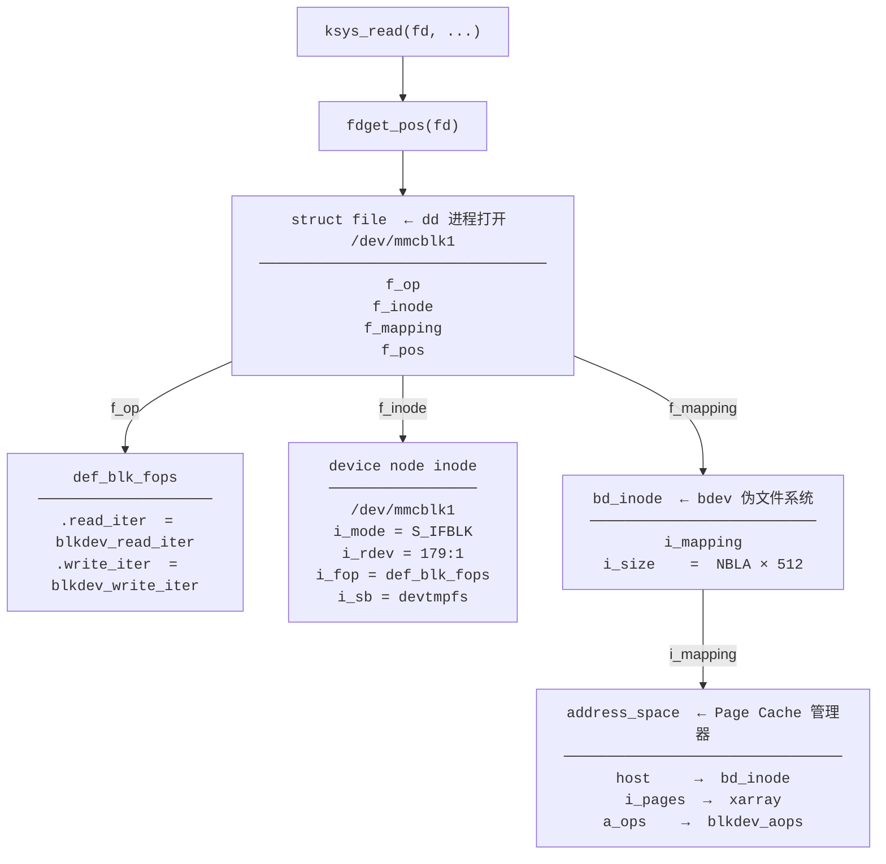

# 05. VFS 与块层通路：从系统调用到 submit_bio

> 本文是 STM32MP257 eMMC 驱动深度分析系列的第 5 篇。
> 从用户态 `read/write` 到 `submit_bio` 的完整路径——以块设备（`/dev/mmcblk1`）为例，打通 VFS 层到块层的调用链。
>
> **前置:** [04-SourceAnalysis.md](04-SourceAnalysis.md) — MMC 初始化流程、块设备注册、blk-mq 队列创建
> **下一篇:** [06-IO-Path.md](06-IO-Path.md) — 从 `submit_bio` 到 eMMC NAND（MMC 核心层、Host 驱动、IDMA）
>
> **字数：**11,481 字
>
> **建议阅读时间：** 40–60 分钟

---

## 5.1 为什么需要这篇

用户敲下 `dd if=/dev/mmcblk1` 后，`read()` 是怎么从用户态经过 VFS、文件系统、块层，最终到达 `submit_bio` 的？这是本文要回答的核心问题。

1. `dd if=/dev/mmcblk1` 的 `read()` 在内核中经过哪些函数，才到达 `submit_bio`？
2. VFS 的四大核心对象（`super_block`、`inode`、`dentry`、`file`）在 eMMC 读/写场景中各扮演什么角色？
3. Buffered write 的数据在到达 `submit_bio` 之前经历了什么？

### 与 06 的分工

| 本文（05） | 06-IO-Path.md |
|-----------|--------------|
| 从系统调用到 `submit_bio` | 从 `submit_bio` 到 eMMC NAND |
| VFS + 块层 | MMC 核心层 + Host 驱动 + IDMA |
| `blkdev_read_iter`、`filemap_read`、`filemap_get_pages` | `mmc_mq_queue_rq`、CMD18/25、IDMA 描述符 |
| `__folio_mark_dirty` → 后台回写 | CMD6 FLUSH_CACHE |

---

## 5.2 VFS 架构概览

### 5.2.1 面向驱动开发者的"一切皆文件"

Linux 中"一切皆文件"的含义不是把内核对象变成文件，而是**用统一文件接口（`open/read/write/close`）访问不同类型的内核对象**。对于驱动开发者，这意味着：

```
用户态操作          背后的内核对象          VFS 路由目标
────────────────────────────────────────────────────────────
dd if=/dev/mmcblk1   块设备 (eMMC)         blkdev_open → def_blk_fops
cat /sys/class/...   kobject 属性          sysfs 文件系统
cat /proc/interrupts 内核动态数据          proc 文件系统
```
对本系列来说，块设备 `/dev/mmcblk1` 走的是 `def_blk_fops` 路径——这是本文的核心。
### 5.2.2 VFS 的分层设计
```
用户态:     fd = open("/dev/mmcblk1", O_RDWR)   read(fd, buf, 4096)
              │                                       │
              ▼                                       ▼
VFS:        do_sys_openat2()                      vfs_read()
              │                                       │
              ▼                                       ▼
具体文件系统: blkdev_open()                         blkdev_read_iter()
              │                                       │
              ▼                                       ▼
块层:       blkdev_get_by_dev()                    filemap_read() → submit_bio()
              │                                       │
              ▼                                       ▼
MMC 层:     (04 已分析: mmc_blk_probe)             (06 分析: mmc_mq_queue_rq → ...)
```
用户态看到的 `read()` 在内核中经过四次转发：系统调用入口 → VFS 通用层 → 块设备特定实现 → 块层提交。每层只做自己职责范围内的事。
---

## 5.3 VFS 四大核心对象

VFS 之所以能支持"一切皆文件"，核心在于它定义了四个层次的对象。本节用 `/dev/mmcblk1` 场景重新梳理。

### 5.3.1 super_block —— 数据通路上不参与

`struct super_block` 代表一个挂载的文件系统实例。但对于 **裸块设备访问**（`dd if=/dev/mmcblk1` 不走任何文件系统），super_block **不参与读写数据通路**。

`bd_inode->i_sb` 指向 devtmpfs 的 super_block——因为设备节点 `/dev/mmcblk1` 本身在 devtmpfs 上，但这个 super_block 仅管理节点元数据（权限、属主），对 `read/write` 调用链无影响：

```c
// include/linux/fs.h — 关键字段
struct super_block {
    struct file_system_type *s_type;    // 文件系统类型
    const struct super_operations *s_op; // 超级块操作表
    struct dentry          *s_root;     // 根目录 dentry
    struct list_head       s_inodes;    // 该 FS 所有 inode 链表
    ...
};
```
这就引出了块设备访问的一个关键认知：**裸设备绕过了文件系统层**。`read()` 从 `def_blk_fops` 直接进入块层通用函数（`blkdev_read_iter`），不需要经过 ext4/btrfs 等具体文件系统。当然后面挂载文件系统后（如 rootfs 用 ext4 挂在 eMMC 上），情况就不一样了——那时文件系统会管理数据布局，但那是另一个话题。
### 5.3.2 inode —— 两个 inode 各司其职
块设备访问涉及 **两个不同的 inode**。要理解为什么有两个，先回答三个问题。
---

#### 问题一：设备节点 inode 是什么？

`open("/dev/mmcblk1")` 时，VFS 通过 devtmpfs 找到设备节点的 inode。它只做一件事——**告知块设备号**：

```c
// include/linux/fs.h — inode 关键字段
struct inode {
    umode_t          i_mode;      // S_IFBLK → 标识为块设备文件
    dev_t            i_rdev;      // 设备号（主/次），如 MKDEV(179, 1)
    const struct file_operations  *i_fop;  // → def_blk_fops
    struct super_block            *i_sb;      // → devtmpfs 的 super_block
    struct address_space          *i_mapping; // 不用于数据读写
    ...
};
```
VFS 从中读出 `i_rdev = 179:1`，设置 `f_op = def_blk_fops`。然后它的任务就结束了。
---

#### 问题二：内核怎么从设备号找到块设备？

字符设备用 `cdev_map`（设备号→cdev 的映射表），块设备不同——它有一个**内部的伪文件系统 `bdev`**。

所有块设备的 `bd_inode` 都分配在这个伪文件系统下，**设备号就是 inode 号**：

```c
// block/bdev.c:385 — 为块设备分配 bd_inode
struct block_device *bdev_alloc(struct gendisk *disk, u8 partno)
{
    inode = new_inode(blockdev_superblock);  // 从 bdev 伪文件系统分配 inode
    ...
    bdev = I_BDEV(inode);             // container_of: inode → block_device
    bdev->bd_inode = inode;           // block_device → inode 回指
    return bdev;
}

// block/bdev.c:426 — 注册到全局哈希表
void bdev_add(struct block_device *bdev, dev_t dev)
{
    bdev->bd_inode->i_ino = dev;              // 设备号当成 inode 号
    insert_inode_hash(bdev->bd_inode);        // 加入全局 inode 哈希表
}
```
查找时用设备号当 inode 号，在伪文件系统里哈希查找：
```c
// block/bdev.c:704 — 通过设备号查找
struct block_device *blkdev_get_no_open(dev_t dev)
{
    inode = ilookup(blockdev_superblock, dev); // dev = 179:1 就是 inode 号
    if (!inode)
        return NULL;
    bdev = &BDEV_I(inode)->bdev;              // container_of 拿到 block_device
    ...
    return bdev;
}
```
整个 open 的查找链：
```
blkdev_open(inode)        ← 设备节点 inode（来自 devtmpfs）
  ↓ i_rdev = 179:1
blkdev_get_no_open(179:1)  ← 用设备号查
  ↓ ilookup(blockdev_superblock, 179:1)  ← 在 bdev 伪文件系统里找
bd_inode (i_ino = 179:1)  ← 找到了！
  ↓ I_BDEV(inode) → container_of
block_device (bdev)       ← 拿到块设备对象
```
| 对比 | 字符设备 | 块设备 |
|------|---------|--------|
| 查找结构 | `cdev_map`（kobj_map 表） | `bdev` 伪文件系统（hash 表） |
| 查找函数 | `cdev_find()` | `ilookup(blockdev_superblock, dev)` |
| 为什么不同 | 字符设备驱动动态注册，只须查 ops | 块设备需要 inode 挂载 Page Cache |
---

#### 问题三：bd_inode 和 i_mapping／Page Cache 是什么？

块设备需要一个自己的 inode 是因为：**Page Cache 需要一个 `struct address_space` 来挂载**。

```c
// include/linux/fs.h:472 — Page Cache 管理器
struct address_space {
    struct inode              *host;       // 所属的 inode（回指 bd_inode）
    struct xarray              i_pages;    // ★ 页缓存本体：页号 → folio 的索引
    unsigned long              nrpages;    // 缓存的总页数
    const struct address_space_operations *a_ops; // → 对块设备: blkdev_aops
    ...
};
```
Page Cache 的本质：**`i_pages` 是一个 xarray（类似 radix tree），以文件页号为 key，以 `struct folio *` 为 value**。
```
bd_inode
  │
  └── i_mapping ──→ address_space (Page Cache)
                      │
                      ├── i_pages: xarray
                      │      ├── [页号 0] → folio_A (刚读入的扇区 0-7)
                      │      ├── [页号 1] → folio_B (扇区 8-15)
                      │      └── [页号 N] → ...
                      │
                      ├── a_ops: blkdev_aops
                      │      .read_folio  = blkdev_read_folio   // 从 eMMC 读
                      │      .dirty_folio = filemap_dirty_folio // 标记脏页
                      │
                      └── nrpages: 缓存命中总数
```

##### Page Cache 里的"页"到底是什么

对 `/dev/mmcblk1` 来说，Page Cache 中存的既不是文件也不是目录——就是**裸块设备数据的副本**。每一个 folio（4KB）对应设备上一段连续的 4KB 原始数据：

```
/dev/mmcblk1 的存储布局（eMMC 以 512B 为一个扇区/LBA）：

       LBA 0 │ sector 0 │  ←─┐
             │ sector 1 │    │
             │ sector 2 │    │  Page Cache 页号 0
             │ sector 3 │    │  (byte 0 ~ 4095)
             │ sector 4 │    │  对应 eMMC LBA 0-7
             │ sector 5 │    │
             │ sector 6 │    │
             │ sector 7 │  ←─┘
       LBA 8 │ sector 8 │  ←─┐
             │ sector 9 │    │  Page Cache 页号 1
             │   ...    │    │  (byte 4096 ~ 8191)
             │ sector 15│  ←─┘  对应 eMMC LBA 8-15
       LBA 16 │   ...   │
```

**页号的计算**：内核代码中随处可见 `pgoff_t index = iocb->ki_pos >> PAGE_SHIFT`。`PAGE_SHIFT` 在 4KB 页的系统上是 12，所以：

```
字节偏移 0      → 页号 0  (0 >> 12 = 0)
字节偏移 4095   → 页号 0  (4095 >> 12 = 0)    ← 仍在同一页内
字节偏移 4096   → 页号 1  (4096 >> 12 = 1)
字节偏移 8191   → 页号 1
字节偏移 8192   → 页号 2
```

所以 xarray 中的 `i_pages[页号 N]` 本质上就是"设备上第 N 个 4KB 块在内存中的副本"：

```
i_pages
  ├── [0]  → folio  <- 设备 byte 0-4095 (eMMC LBA 0-7)
  ├── [1]  → folio  <- 设备 byte 4096-8191 (eMMC LBA 8-15)
  ├── [2]  → folio  <- 设备 byte 8192-12287 (eMMC LBA 16-23)
  └── ...
```

**重要的推论**：就算你只读 1 个字节（`dd bs=1 count=1`），内核也会分配一整个 4KB folio，从 eMMC 读入 4KB（8 个扇区）。然后只拷贝你需要的 1 字节到用户态。后续对同一页内其他字节的访问就直接命中缓存了。这就是 Page Cache 的粒度——按页管理，不按字节。

`dd if=/dev/mmcblk1 bs=512 count=1`（读一个扇区）在 Page Cache 中产生的行为：

```
用户请求: 读 512 字节 (LBA 0, byte 0-511)
  → 内核计算: byte 0 >> 12 = 页号 0
  → 查 i_pages[0]: 空
  → submit_bio: 读 eMMC LBA 0-7（一整页 4KB，尽管只要 512B）
  → folio 插入 i_pages[0]
  → copy_to_user: 拷贝前 512 字节给 dd
  → 剩下 3584 字节留在缓存中，下次免费
```

**页号在代码中的含义**：当你在 `filemap_get_pages` 中看到 `pgoff_t index = iocb->ki_pos >> PAGE_SHIFT`，它就是在问一个很简单的问题——"当前要读的字节偏移落在第几个 4KB 块上"。

**Page Cache 实际干了两件事：缓存 + 延迟写。**
举个具体的例子。你在 ATK 板上执行：
```bash
dd if=/dev/mmcblk1 of=/dev/null bs=4k count=1   # 第一次读
```
背后发生了什么：
```
① read() → filemap_read() → 查 i_pages 找页号 0
     → 没找到（cache miss）
     → 调 a_ops.read_folio (= blkdev_read_folio)
       → 分配 folio → submit_bio（从 eMMC 读 4KB）
       → 读完，把 folio 插入 i_pages（页号 0 → folio）
     → 把数据 copy_to_user 到 dd 的缓冲区
② dd 第二次读同一块（bs=4k skip=0）：
     → read() → filemap_read() → 查 i_pages 找页号 0
     → 找到 folio 了（cache hit）
     → 直接 copy_to_user，不需要再 submit_bio！
```
写时反过来，Page Cache 让写操作立即返回，不等待磁盘：
```bash
echo "hello" > /dev/mmcblk1   # 写入 5 字节
```
```
① write() → filemap_write() → 在 i_pages 中找到或创建 folio
     → copy_from_user 把 "hello\n" 写入 folio
     → 调 a_ops.dirty_folio 标记该 folio 为"脏"
     → 立即返回用户态（几微秒完成，不等磁盘！）
② 几秒后内核 writeback 线程扫到脏 folio：
     → 调 a_ops.writepages 或直接 submit_bio
     → 真正把数据写入 eMMC（几十毫秒）
```
**Page Cache 的本质作用：把 eMMC 的慢（微秒-毫秒级）变成内存的快（纳秒级），并把多次小写合并成一次大刷。**
所以 `bd_inode->i_mapping` 就是这个缓存的入口。没有它，每次 `read/write` 都要直接访问 eMMC——性能会惨不忍睹。
**为什么需要 `bd_inode` 而不是直接用设备节点 inode？** 因为同一个块设备可以通过多个路径访问，它们必须共享同一个 Page Cache：
```
/dev/mmcblk1  ──→ devtmpfs inode A ──┐
                                      ├──→ Page Cache (同一份)
/tmp/disk     ──→ devtmpfs inode B ──┘       ↑
                                             │
                                   ┌─────────┴────────────┐
                                   │  bd_inode (唯一)      │
                                   │  i_mapping = 这个缓存  │
                                   └──────────────────────┘
```
不管从哪个路径打开，`blkdev_open` 都把 `filp->f_mapping` 替换成 `bd_inode->i_mapping`，保证缓存一致。
**但分区之间是独立的。** `/dev/mmcblk1`（整盘）和 `/dev/mmcblk1p1`（分区 1）是两个不同的 `block_device`，各有各的 `bd_inode` 和 `i_mapping`：
```
设备号       bd_inode            i_mapping（Page Cache）
───────     ────────────         ────────────────────────
179:0       mmcblk1 (整盘)       → address_space (整盘)
179:1       mmcblk1p1 (分区 1)   → address_space (分区 1) ← 互不共享
179:2       mmcblk1p2 (分区 2)   → address_space (分区 2) ← 互不共享
```
因为分区是磁盘上独立的存储区域，缓存不需要跨分区共享。
---

#### 小结：三个角色如何拼接

```
blkdev_open() 收到来自 devtmpfs 的设备节点 inode
  │
  ├── 读 i_rdev = 179:1          ← 设备节点 inode：告诉内核"找哪个设备"
  ├── 读 i_fop → def_blk_fops    ← 设备节点 inode：告诉 VFS "用哪个操作表"
  │
  ├── blkdev_get_no_open(179:1)
  │     → ilookup(blockdev_superblock, 179:1)  ← bdev 伪文件系统：按设备号查
  │     → I_BDEV(inode) → block_device         ← container_of：拿块设备对象
  │
  └── filp->f_mapping = bdev->bd_inode->i_mapping
                                    ← bd_inode：提供 Page Cache 挂载点
```
| 角色 | 是谁 | 存哪 | 做什么 |
|------|------|------|--------|
| 门牌 | 设备节点 inode | devtmpfs | 存设备号，供 VFS 路径解析 |
| 索引 | `bdev` 伪文件系统 | `blockdev_superblock` | 设备号 → block_device 的哈希索引 |
| 房间 | bd_inode | `bdev_inode`（内嵌在 block_device 旁） | 提供 Page Cache（`i_mapping`）|
### 5.3.3 dentry —— 路径名缓存
`dentry` 缓存路径名到 `inode` 的映射。第一次访问 `/dev/mmcblk1` 后，内核创建三级 dentry 树：
```
dentry: "/"           →  inode(根目录)
  └── dentry: "dev"   →  inode(/dev)       ← 可能跨越挂载点到 devtmpfs
        └── dentry: "mmcblk1" → 设备节点 inode
```
第二次访问时直接从 dentry 缓存中拿到设备节点 inode，零次磁盘 IO。
```c
struct dentry {
    struct dentry *d_parent;      // 父目录 dentry
    struct inode  *d_inode;       // → 设备节点 inode
    const struct qstr d_name;     // "mmcblk1"
    struct list_head d_child;     // 兄弟节点
    struct hlist_head d_children; // 子节点
    ...
};
```
### 5.3.4 file —— dd 进程的"打开会话"
每次 `open("/dev/mmcblk1")` 创建一个新的 `struct file`，记录本次打开的独立状态：
```c
struct file {
    const struct file_operations *f_op;  // → def_blk_fops
    struct inode                 *f_inode; // → 设备节点 inode（来自 dentry）
    struct path                   f_path;  // 包含 dentry + vfsmount
    loff_t                        f_pos;  // 当前读写偏移
    struct address_space          *f_mapping; // → bd_inode->i_mapping（blkdev_open 替换）
    void                          *private_data; // 块设备私有数据
    ...
};
```
对块设备来说，`f_mapping` 在 `blkdev_open()` 中被设为 `bdev->bd_inode->i_mapping`（`block/fops.c:597`）。这个 `f_mapping` 是 `filemap_read()` 和 `filemap_write()` 定位 Page Cache 的入口。
### 5.3.5 四大对象的关联关系图

---

## 5.4 OPEN 流程：打开 /dev/mmcblk1

open 是 VFS 建立从路径到 inode 再到 file 的绑定的过程。这里只简述块设备相关的关键步骤。

### 5.4.1 路径解析到 bd_inode

用户态 `open("/dev/mmcblk1", O_RDWR)` 进入内核后，`do_sys_openat2()`（`fs/open.c`）做三件事：

```c
fd = get_unused_fd_flags(flags);       // ① 分配 fd 号
struct file *f = do_filp_open(dfd, tmp, &op);  // ② 路径解析 + 创建 file
fd_install(fd, f);                      // ③ 将 file 装入 fd 表
```
第②步 `do_filp_open()` 内部调用 `path_openat()`，其核心是路径解析和 `do_open()`：
```
path_openat()
  ├─ alloc_empty_file()      ← 分配空的 struct file
  ├─ path_init()             ← 设置解析起点（当前根目录 dentry）
  ├─ link_path_walk()        ← 逐段解析 "dev"，找到 /dev 的 inode
  ├─ open_last_lookups()     ← 解析最后分量 "mmcblk1"
  │    → dentry("mmcblk1") 的 d_inode = bd_inode
  │    → bd_inode->i_mode = S_IFBLK
  │    → bd_inode->i_fop   = def_blk_fops
  └─ do_open() → vfs_open() → do_dentry_open()
```
### 5.4.2 do_dentry_open —— 绑定 f_op
`do_dentry_open()`（`fs/open.c`）是关键：它将路径解析得到的 inode 绑定到 file 上。
```c
static int do_dentry_open(struct file *f, int (*open)(struct inode *, struct file *))
{
    struct inode *inode = f->f_path.dentry->d_inode;  // → bd_inode
    f->f_inode = inode;                    // ① 绑定 inode
    f->f_mapping = inode->i_mapping;        // ② 绑定 address_space
    f->f_op = fops_get(inode->i_fop);       // ③ 关键：f_op = def_blk_fops
    if (!open)
        open = f->f_op->open;               // → blkdev_open
    if (open)
        error = open(inode, f);             // ④ 调用 blkdev_open
    ...
}
```
对块设备：第③步 `f_op = def_blk_fops`，第④步 `open = blkdev_open`。
**与字符设备的对比：**
<table>
<thead>
<tr>
<th>步骤</th>
<th>字符设备 (chrdev)</th>
<th>块设备 (blkdev)</th>
</tr>
</thead>
<tbody>
<tr>
<td><code>inode->i_fop</code></td>
<td><code>def_chr_fops</code>（<code>.open = chrdev_open</code>）</td>
<td><code>def_blk_fops</code>（<code>.open = blkdev_open</code>）</td>
</tr>
<tr>
<td><code>do_dentry_open</code> 第③步后 <code>f_op</code></td>
<td><code>def_chr_fops</code>（临时）</td>
<td><code>def_blk_fops</code>（<strong>最终</strong>）</td>
</tr>
<tr>
<td><code>f_op->open</code> 调用</td>
<td><code>chrdev_open()</code> → 查 <code>cdev_map</code> → <strong>替换 <code>f_op</code> 为驱动 fops</strong></td>
<td><code>blkdev_open()</code> → 获取 bdev → <strong>不替换 <code>f_op</code></strong></td>
</tr>
<tr>
<td>open 返回后 <code>f_op</code></td>
<td>驱动注册的 fops（如 <code>my_gpio_fops</code>）</td>
<td><code>def_blk_fops</code>（不变）</td>
</tr>
<tr>
<td colspan="3"><strong>字符设备多一层间接</strong>：因为字符设备驱动种类繁多（成千上万），无法在 VFS 层静态绑定，所以通过 <code>chrdev_open</code> 在运行时按设备号查找并替换。<strong>块设备则不然</strong>——<code>def_blk_fops</code> 中的 <code>read_iter</code> / <code>write_iter</code> 指向块层通用函数，块设备特有的读写逻辑在 blk-mq 层（<code>submit_bio</code> 之后）处理，不需要替换 <code>f_op</code>。</td>
</tr>
</tbody>
</table>
### 5.4.3 blkdev_open —— 获取 block_device
```c
// block/fops.c:569
static int blkdev_open(struct inode *inode, struct file *filp)
{
    struct block_device *bdev;
    bdev = blkdev_get_by_dev(inode->i_rdev, file_to_blk_mode(filp),
                             filp->private_data, NULL);
    // 用设备号查 bdget → bdev 缓存 → 初始化
    filp->f_mapping = bdev->bd_inode->i_mapping;
    // ★ 关键：将 file 的 Page Cache 入口指向块设备的 address_space
    filp->f_wb_err = filemap_sample_wb_err(filp->f_mapping);
    return 0;
}
```
`blkdev_get_by_dev()` 根据 `inode->i_rdev`（设备号）在 `bdev_map` 中找到或创建 `struct block_device`。`blkdev_open` 的最后一步将 `filp->f_mapping` 指向 `bdev->bd_inode->i_mapping`——这个赋值决定了后续 `filemap_read()` 操作的 Page Cache 属于这个块设备。
### 5.4.4 open 终点状态
```
open("/dev/mmcblk1") 返回后:
进程:          dd (PID xxx)
fd:            3（存入 task_struct->files->fdt[3]）
struct file:   f_op   = def_blk_fops
               f_inode    = bd_inode
               f_mapping  = bd_inode->i_mapping  ← Page Cache
               f_pos      = 0
               private_data = NULL
下一步:        用户态调用 read(fd, buf, 4096)
```
---

## 5.5 READ 流程：vfs_read 到 submit_bio

本节从 `dd` 的 `read()` 出发，沿函数调用链逐层分析到 `submit_bio`。这是 06 第一幕的前置知识。

### 5.5.1 全程函数追踪

```
read(fd, buf, 4096)                  [用户态]
│
├─ ksys_read(fd, buf, count)         fs/read_write.c:602
│   ├─ fdget_pos(fd)                 → struct file *
│   └─ vfs_read(file, buf, count, &pos)
│
├─ vfs_read()                        fs/read_write.c:450
│   ├─ rw_verify_area()              权限检查
│   ├─ file->f_op->read?             没有（def_blk_fops 无 .read）
│   └─ new_sync_read()               → 走 .read_iter 路径
│
├─ new_sync_read()                   fs/read_write.c:379
│   ├─ init_sync_kiocb(&kiocb, filp) 包装 IO 控制块
│   ├─ iov_iter_ubuf(&iter, buf)     包装用户 buffer
│   └─ call_read_iter(filp, &kiocb, &iter)  → f_op->read_iter
│
├─ blkdev_read_iter(&kiocb, &iter)   block/fops.c:693
│   ├─ I_BDEV(f_mapping->host)       获取 block_device
│   ├─ Direct IO? → blkdev_direct_IO (旁路)
│   └─ filemap_read(&kiocb, &iter)   ← 主角！
│
├─ filemap_read()                    mm/filemap.c:2643
│   ├─ filp->f_mapping               → bd_inode->i_mapping
│   ├─ filemap_get_pages()           查 Page Cache（详见下节）
│   ├─ copy_page_to_iter()           从 folio 拷贝到用户 buffer
│   └─ 循环直到数据读完
│
├─ filemap_get_pages()               mm/filemap.c:2561
│   ├─ filemap_get_read_batch()      查 xarray（缓存命中检查）
│   ├─ page_cache_sync_readahead()   （可选）预读
│   ├─ filemap_create_folio()        缺页：分配 + 读盘
│   └─ filemap_update_page()         更新 stale folio
│
└─ filemap_create_folio()            mm/filemap.c:2504
    ├─ filemap_alloc_folio()         从伙伴系统分配 4KB 物理页
    ├─ filemap_add_folio()           加入 xarray
    └─ filemap_read_folio()          调 a_ops->read_folio
         └─ mapping->a_ops->read_folio()
              = blkdev_read_folio()
                → iomap_read_folio()
                  → submit_bio()     ★ 进入块层！
```
### 5.5.2 逐层源码分析
#### ksys_read —— fd 到 file（`fs/read_write.c:602`）
```c
ssize_t ksys_read(unsigned int fd, char __user *buf, size_t count)
{
    struct fd f = fdget_pos(fd);         // O(1) 取 file：task->files->fdt[fd]
    loff_t pos, *ppos = file_ppos(f.file); // 取 file->f_pos
    if (ppos) {
        pos = *ppos;                     // 保存当前位置
        ppos = &pos;
    }
    ret = vfs_read(f.file, buf, count, ppos); // → VFS 通用层
    if (ret >= 0 && ppos)
        f.file->f_pos = pos;             // 更新 file->f_pos
    fdput_pos(f);
    return ret;
}
```
`fdget_pos(fd)` 做的是简单的数组索引——进程的 `task_struct->files->fdt` 是一个 `struct file **` 数组，`fd` 就是数组下标。open 时 `fd_install()` 把 `struct file *` 存入这个槽位。
#### vfs_read —— 权限检查 + 分发（`fs/read_write.c:450`）
```c
ssize_t vfs_read(struct file *file, char __user *buf, size_t count, loff_t *pos)
{
    ret = rw_verify_area(READ, file, pos, count); // 验证可读、范围合法
    if (ret) return ret;
    if (count > MAX_RW_COUNT) count = MAX_RW_COUNT;
    if (file->f_op->read)                          // .read 优先
        ret = file->f_op->read(file, buf, count, pos);
    else if (file->f_op->read_iter)                // 否则 .read_iter
        ret = new_sync_read(file, buf, count, pos); // def_blk_fops 由此转入 read_iter
    else
        ret = -EINVAL;
    ...
}
```
#### new_sync_read —— 包装 kiocb（`fs/read_write.c:379`）
```c
static ssize_t new_sync_read(struct file *filp, char __user *buf, size_t len, loff_t *ppos)
{
    struct kiocb kiocb;
    struct iov_iter iter;
    init_sync_kiocb(&kiocb, filp);     // 初始化 IO 控制块（关联 filp）
    kiocb.ki_pos = (ppos ? *ppos : 0); // 设置起始偏移
    iov_iter_ubuf(&iter, ITER_DEST, buf, len); // 包装用户空间 buffer
    ret = call_read_iter(filp, &kiocb, &iter);  // → f_op->read_iter()
    if (ppos)
        *ppos = kiocb.ki_pos;                   // 更新 pos
    return ret;
}
```
这两个结构体是 VFS 层向下传递 IO 参数的"标准信封"——所有 `->read_iter` / `->write_iter` 回调都靠它们传递信息。

**`struct kiocb` —— "IO 票据"，封装操作上下文：**

```c
struct kiocb {
    struct file    *ki_filp;      // 哪个文件（mmcblk1）
    loff_t          ki_pos;       // 起始偏移（read/write 位置）
    void (*ki_complete)(...);     // NULL = 同步 IO（dd 默认），非 NULL = 异步
    int             ki_flags;     // IOCB_DIRECT（O_DIRECT 跳过 Page Cache）等
    u16             ki_ioprio;    // IO 优先级
};
```

拿 `dd if=/dev/mmcblk1 bs=4k count=1 skip=0` 为例。`new_sync_read` 在栈上创建 kiocb，填好上下文后传给 `blkdev_read_iter`：

```
dd 的 read(fd, buf, 4096)
  │
  ▼  vfs_read → new_sync_read
  │
  ├─ init_sync_kiocb(&kiocb, filp)     ki_filp  = dd 打开的 /dev/mmcblk1
  │                                    ki_flags = 0（同步，非 direct）
  │                                    ki_complete = NULL（同步标记）
  │
  └─ kiocb.ki_pos = *ppos = 0          ki_pos   = 0（从开头读）
       │
       ▼  call_read_iter → blkdev_read_iter(iocb, to)
            │
            ├─ pos = iocb->ki_pos;          // = 0，拿到文件偏移
            ├─ iocb->ki_flags & IOCB_DIRECT // false，走 Page Cache 路径
            └─ 读完后 *ppos = kiocb.ki_pos  // 更新为 4096，下次继续
```

注意 `ki_pos` 的传递方式：`new_sync_read` 从 `*ppos` 拷贝进来，`blkdev_read_iter` 不会修改它，读完后 `new_sync_read` 将更新后的值写回 `*ppos`。这样上层（`vfs_read`）就能维护文件位置。

**`struct iov_iter` —— "buffer 迭代器"，抽象数据目的/来源：**

```c
struct iov_iter {
    u8    iter_type;       // ITER_UBUF | ITER_IOVEC | ITER_BVEC | ITER_KVEC
    bool  data_source;     // READ（读入）or WRITE（写出）
    union {
        void __user *ubuf;           // ITER_UBUF：单段用户 buffer
        const struct iovec *__iov;   // ITER_IOVEC：多段 scatter-gather
        const struct bio_vec *bvec;  // ITER_BVEC：bio 页向量（块层用）
    };
    size_t count;          // 还剩多少字节
    unsigned long nr_segs; // 段数
};
```

它解决的核心问题是：**调用者只需说"数据要放到哪"，而不需关心那是什么类型的内存**。`new_sync_read` 中用 `iov_iter_ubuf` 把 dd 传来的用户态指针包装成 `ITER_UBUF` 类型：

```
用户态 dd 的 buf（虚拟地址 0x7f...）
  │
  ▼  iov_iter_ubuf(&iter, READ, buf, 4096)
  │
  iter = {
      .iter_type   = ITER_UBUF,      // 单段用户 buffer
      .ubuf        = 0x7f....,       // 用户态虚拟地址
      .count       = 4096,           // 4KB
      .data_source = READ,           // 读操作（数据从设备来）
  }
```

`blkdev_read_iter` 通过 `iov_iter_count(to)` 拿到传输字节数，不需要知道 buffer 具体在哪：

```c
count = iov_iter_count(to);   // = 4096，不管 buf 在用户态还是内核态
if (pos + count > size)       // 越界检查
    iov_iter_truncate(to, n); // 截断到设备边界
```

**为什么需要两种抽象？** 因为它们解决不同的问题：

| 结构体 | 类比 | 职责 |
|--------|------|------|
| `kiocb` | 快递面单 | "寄什么文件、从哪开始、加急还是普通" |
| `iov_iter` | 收货地址 | "数据放到哪里、家里还是公司、分几包" |

驱动的 `read_iter` 回调拿到这两个参数，就知道"从哪个文件的哪个位置读，读出来的数据放到哪"——不需要知道调用者是 `dd` 还是 `cp`，也不需要知道 buffer 在用户态还是内核态。

#### blkdev_read_iter —— 块设备读（`block/fops.c:693`）
```c
static ssize_t blkdev_read_iter(struct kiocb *iocb, struct iov_iter *to)
{
    struct block_device *bdev = I_BDEV(iocb->ki_filp->f_mapping->host);
    // 调用链: filp → f_mapping → host(bd_inode) → I_BDEV → block_device
    loff_t size = bdev_nr_bytes(bdev);
    loff_t pos = iocb->ki_pos;
    // 检查 pos 是否越界
    if (unlikely(pos + iov_iter_count(to) > size)) {
        if (pos >= size) return 0;       // 已到末尾
        size -= pos;
        shorted = iov_iter_count(to) - size;
        iov_iter_truncate(to, size);     // 截断到设备大小
    }
    count = iov_iter_count(to);
    if (!count) goto reexpand;
    if (iocb->ki_flags & IOCB_DIRECT) {  // Direct IO → 跳过 Page Cache
        ret = kiocb_write_and_wait(iocb, count);
        if (ret < 0) goto reexpand;
        file_accessed(iocb->ki_filp);
        ret = blkdev_direct_IO(iocb, to);
        ...
    }
    ret = filemap_read(iocb, to, ret);   // ← Buffered IO → Page Cache 路径
    ...
}
```
`I_BDEV` 宏（`block/bdev.c:43`）从 `bd_inode` 反推出 `struct block_device`。这是 VFS 层和块设备层的分水岭——`filemap_read` 返回后，数据从 Page Cache 拷贝到用户 buffer；如果缓存未命中，内部触发 `a_ops->read_folio` 构造 `bio`，调用 `submit_bio` 进入块层。
#### filemap_read —— 循环：取 folio → 拷数据 → 再取（`mm/filemap.c:2643`）

`filemap_read` 的逻辑一句话就能说清：**在一个循环里反复调用 `filemap_get_pages` 拿到 folio，然后用 `copy_page_to_iter` 把 folio 里的数据拷给用户**。

```c
ssize_t filemap_read(struct kiocb *iocb, struct iov_iter *iter,
                     ssize_t already_read)
{
    struct address_space *mapping = filp->f_mapping; // → bd_inode->i_mapping
    struct folio_batch fbatch;
    folio_batch_init(&fbatch);
    do {
        cond_resched();
        error = filemap_get_pages(iocb, iter->count, &fbatch, false);
        //    ↑ 核心：从 Page Cache 拿 folio（可能是缓存命中，也可能触发 IO）
        if (error < 0) break;
        //   把 folio 里的数据拷到用户 buffer
        for (i = 0; i < folio_batch_count(&fbatch); i++) {
            struct folio *folio = fbatch.folios[i];
            copied = copy_page_to_iter(folio, offset, bytes, iter);
            // ★ 这一步才是数据真正到达用户态的时刻！
        }
    } while (iov_iter_count(iter) && !error);
    //       ↑ 用户要的数据还没拷完？继续循环
    ...
}
```

**为什么需要循环？** 因为一次 `filemap_get_pages` 可能只取到部分 folio，而用户请求可能很大。比如 `dd if=/dev/mmcblk1 bs=1M count=1` 要读 1MB（256 个 folio），但 `filemap_get_pages` 一次可能只拿到几个——循环会反复调用直到拷完或出错。

拿最简场景看循环怎么跑：

```
dd if=/dev/mmcblk1 bs=4k count=2  （读 8KB，2 个 folio）

首次进入 do {} while：
  filemap_get_pages(iocb, count=8192, ...)
    → 假设缓存全空，触发 IO 读入页号 0（第一次调用返回 1 个 folio）
  copy_page_to_iter(folio[0], ...)  → 拷走 4096 字节，iter 还剩 4096
  while (iov_iter_count(iter) == 4096) → 条件成立，继续循环

第二次迭代：
  filemap_get_pages(iocb, count=4096, ...)
    → 页号 1 已被 readahead 预取，缓存命中
  copy_page_to_iter(folio[1], ...)  → 拷走 4096 字节，iter 还剩 0
  while (iov_iter_count(iter) == 0) → 条件假，退出循环
```

`filemap_read` 自己不关心数据从哪来——它只负责"拿到了就拷，拷完再拿"。真正的决策在 `filemap_get_pages` 里。

#### filemap_get_pages —— 三级缓存决策（`mm/filemap.c:2561`）

这个函数的核心逻辑是一个**三级判断**：先查 xarray（缓存命中？）→ 没命中？试试 readahead → readahead 也没用？自己分配并读盘。

```c
static int filemap_get_pages(struct kiocb *iocb, size_t count,
                             struct folio_batch *fbatch, bool need_uptodate)
{
    struct address_space *mapping = filp->f_mapping;
    pgoff_t index = iocb->ki_pos >> PAGE_SHIFT;  // 字节偏移 → 页号
    // ── 第 1 关：查 xarray ──────────────────────────────
    filemap_get_read_batch(mapping, index, last_index - 1, fbatch);
    if (!folio_batch_count(fbatch)) {
        // ── 第 2 关：readahead 推测性预读 ──────────────────
        page_cache_sync_readahead(mapping, ra, filp, index, last_index - index);
        filemap_get_read_batch(mapping, index, last_index - 1, fbatch);
    }
    if (!folio_batch_count(fbatch)) {
        // ── 第 3 关：真缺页，自己分配自己读 ────────────────
        err = filemap_create_folio(filp, mapping, index, fbatch);
    }
    // ── 善后：folio 存在但数据还没到 → 等它到 ──────────
    folio = fbatch->folios[...];
    if (!folio_test_uptodate(folio)) {
        err = filemap_update_page(iocb, mapping, count, folio, need_uptodate);
    }
    return 0;
}
```

三级决策对应三种性能路径，用 `dd if=/dev/mmcblk1 bs=4k count=4` 来演示：

---

**第 1 关：`filemap_get_read_batch` —— 查 xarray，缓存命中即返回（~100ns）**

这是最快的路。内核在 `mapping->i_pages`（xarray）中以页号为 key 找 folio：

```
假设进程此前从未读过 /dev/mmcblk1：

首次 read(4096) → 查 i_pages[0]:
  → xas_load 返回 NULL（空的 xarray，从未读过）
  → folio_batch_count = 0 → 掉进第 2 关

第二次 read(4096) → dd 接着读下一页，查 i_pages[1]:
  → 找到 folio 了！← 第一次 read 时 readahead 预取进来的
  → folio_batch_count = 1 → 直接返回
  → filemap_read 的循环里 copy_page_to_iter 拷走数据
```

---

**第 2 关：`page_cache_sync_readahead` —— 推测性预读（~100μs）**

只在第 1 关完全没找到任何 folio 时触发。内核判断"你正在顺序读，我猜你还会继续读"，于是提前提交一批 IO：

```
第一条 read(4096) 执行时：

filemap_get_read_batch → 空
  │
  ▼  page_cache_sync_readahead(mapping, ra, filp, index=0, nr_to_read=4)
  │
  ├─ 读模式判断: dd 从头顺序读 → 启用 readahead
  ├─ 提交 readahead IO: 一次读入 4 个 folio（页号 0-3，共 16KB）
  │    → a_ops->readahead → blkdev_readahead → submit_bio
  │    → 等 IO 完成（~100μs），i_pages[0..3] 全部就绪
  └─ 再次 filemap_get_read_batch
       → 页号 0-3 全有了，取回页号 0 的 folio

剩下页号 1-3 留在缓存中，后面三条 read() 全部第 1 关命中，零 IO
```

上例 `count=4` 只有第一次触发磁盘 IO（readahead 批量读入 4 页），后面三次全部缓存命中。**把多次小 IO 合并为一次大 IO，这就是顺序读快的根本原因。**

你可能会问：**"第 2 关和第 3 关不都要读 eMMC 吗？为什么不跳过第 2 关直接读？"**

这是一个好问题。关键区别不在"读不读"，而在**读多少**：

| | 第 2 关 readahead | 第 3 关 create_folio |
|---|---|---|
| 读多少 | 4 页（16KB），推测性的 | 1 页（4KB），只要当前需要的 |
| 什么时候用 | 检测到顺序访问时 | 检测到随机访问时 |
| 等效 eMMC IO | 1 次 submit_bio 读 8 个连续 LBA | 1 次 submit_bio 读 8 个连续 LBA |

**两个关都读 eMMC，差别不是"读不读"，而是"读多少"**。第 2 关赌你会顺序读下去，一次多读几页摊薄 IO 开销；第 3 关不赌，读当前这页就停。

以 `dd if=/dev/mmcblk1 bs=4k count=4` 为例，对比"有 readahead"和"没有 readahead"的差别：

```
有 readahead（实际行为）:
  第 1 次 read → 第 2 关 readahead → 读 4 页 ← 1 次 IO
  第 2 次 read → 第 1 关命中      → 不读   ← 0 次 IO
  第 3 次 read → 第 1 关命中      → 不读   ← 0 次 IO
  第 4 次 read → 第 1 关命中      → 不读   ← 0 次 IO
  ─────────────────────────────────────────
  总计: 1 次 IO                   ← 每次 IO 读 4 页 ≈ 100μs

没有 readahead（每次都走第 3 关）:
  第 1 次 read → 第 3 关 create   → 读 1 页 ← 1 次 IO
  第 2 次 read → 第 3 关 create   → 读 1 页 ← 1 次 IO
  第 3 次 read → 第 3 关 create   → 读 1 页 ← 1 次 IO
  第 4 次 read → 第 3 关 create   → 读 1 页 ← 1 次 IO
  ─────────────────────────────────────────
  总计: 4 次 IO                   ← 每次 IO 读 1 页 ≈ 4 × 100μs
```

一次读 4 页比四次读 1 页快了约 **4 倍**，因为 eMMC 的 IO 有固定开销（命令发送、总线传输、中断处理），分摊到多页上就更划算。简单说：**第 2 关是"赌你会接着读，多读点省运费"；第 3 关是"不赌了，要什么读什么"**。

---

**第 3 关：`filemap_create_folio` —— 真缺页，分配+读盘（~1ms）**

readahead 是推测性的——如果读模式不是顺序的，它可能什么都不做。这时第 2 关没帮上忙，内核只能自己动手。

```
场景: dd if=/dev/mmcblk1 bs=4k skip=10000 count=1（随机跳转读）

filemap_get_read_batch → 空（xarray 里根本没有页号 10000）
  │
  ▼  page_cache_sync_readahead
  │    内核判断: 上次读页号 0，这次跳 10000 → 非顺序读
  │    → readahead 直接退出（不浪费 IO 读不相干的页）
  │
  ▼  filemap_get_read_batch → 还是空
  │
  ▼  filemap_create_folio(filp, mapping, index=10000, fbatch)
  │     这是最慢的路，必须同步等：
  │
  ├─ filemap_alloc_folio()     从伙伴系统分配 4KB 物理内存
  ├─ filemap_add_folio()       插入 mapping->i_pages[10000]
  ├─ mapping->a_ops->read_folio → blkdev_read_folio → submit_bio
  │     └─ 发 IO 到 eMMC，读 eMMC LBA 80000-80007（页号 10000 × 8）
  └─ 等 IO 完成返回              ← ~1ms（eMMC 随机读延迟）
```

**第 2 关和第 3 关的本质区别**：
- 第 2 关（readahead）："我猜你要什么，先批量读进来"
- 第 3 关（create_folio）："你必须等，我现在就去读这一个"

---

**第 4 步 `filemap_update_page` —— folio 在，但数据还没到**

folio 在 xarray 里（第 1 关找到了），但还不是 `uptodate`（数据没就绪）。最常见的原因：readahead 提交了 IO 但还没完成。

```
进程 A 调 readahead 提交了页号 0-3 的 IO
  → i_pages[0..3] 已插入 folio（占位了），但数据还没读上来
  → folio_test_uptodate() == false，folio 处于 locked 状态

进程 B 读页号 0：
  filemap_get_read_batch → 找到页号 0 的 folio！（不像第 1/2 关那样为空）
    ↓ 但检查 uptodate → false
    ↓ 进 filemap_update_page
    ↓ folio_trylock → 锁被 readahead 线程持有 → folio_put_wait_locked
    ↓ 睡眠 → readahead IO 完成 → folio unlock → 被唤醒
    ↓ 再检查 uptodate → true → 返回
```

这也是为什么 readahead 提交多个 folio 后，后续 read 即使从 xarray 找到了 folio，也可能需要短暂等待。

---

**四种路径汇总：**

| 路径 | 触发条件 | 行为 | 延迟 |
|------|---------|------|------|
| ① `filemap_get_read_batch` | xarray 找到 uptodate folio | 直接返回，零 IO | ~100ns |
| ② `page_cache_sync_readahead` | ① 返回空 | 推测性批量预读 + 再查 | ~100μs（IO） |
| ③ `filemap_create_folio` | ② 后仍然空 | 分配 folio → submit_bio 同步读 | ~1ms+（eMMC IO） |
| ④ `filemap_update_page` | folio 存在但未 uptodate | 等 IO 完成 / 发起补读 | 取决于 IO 进度 |

#### filemap_create_folio —— 第 3 关的实况（`mm/filemap.c:2504`）

第 3 关是"最老实"的路——不猜、不等，直接分配内存 + 读磁盘。看它的实现：

```c
static int filemap_create_folio(struct file *file,
        struct address_space *mapping, pgoff_t index,
        struct folio_batch *fbatch)
{
    // ① 从伙伴系统分配 4KB 物理内存
    folio = filemap_alloc_folio(mapping_gfp_mask(mapping), 0);

    // ② 插入 xarray：告诉其他线程"这个页号我在处理了"
    //    如果返回 -EEXIST，说明其他线程已经插入了，重试
    filemap_invalidate_lock_shared(mapping);
    error = filemap_add_folio(mapping, folio, index,
                              mapping_gfp_constraint(mapping, GFP_KERNEL));

    // ③ ★ 从 eMMC 读数据！
    //    mapping->a_ops->read_folio → 对块设备 = blkdev_read_folio
    //    → iomap_read_folio() → submit_bio()
    error = filemap_read_folio(file, mapping->a_ops->read_folio, folio);
    ...
}
```

第③步的 `filemap_read_folio` 调用 `mapping->a_ops->read_folio`。对块设备这个回调就是 `blkdev_read_folio`（`block/fops.c`）。它内部构造 `struct bio`，然后调用 `submit_bio`——**这就是 VFS 层和块层的分界线**。`submit_bio` 之后，流程进入 blk-mq，由 MMC 块层驱动接管。本文到此为止，06 第一幕从这里开始。
### 5.5.3 读路径全过程数据流
```
vfs_read()
  │  file = fdget(fd), f_op = def_blk_fops
  ▼
new_sync_read()
  │  包装 kiocb + iov_iter
  ▼  
blkdev_read_iter()
  │  I_BDEV(f_mapping->host) 获取 bdev
  │  Direct IO? → blkdev_direct_IO
  ▼
filemap_read()
  │  mapping = filp->f_mapping (bd_inode->i_mapping)
  ▼
filemap_get_pages()
  │  index = ki_pos >> PAGE_SHIFT
  ├───① filemap_get_read_batch(mapping->i_pages, index)  → 命中? 拷贝到用户态
  ├───② page_cache_sync_readahead()                        → 预读
  └───③ filemap_create_folio()                              → 缺页!
        │
        ▼
        filemap_read_folio(mapping->a_ops->read_folio)
          = blkdev_read_folio()
            → iomap_read_folio()
              → submit_bio(bio)  ★ 进入块层 → 06 接管
```
---

## 5.6 WRITE 流程：vfs_write 到 submit_bio

写路径分为两种模式：

| 模式 | 数据路径 | write() 返回时机 | 真正 IO 执行者 |
|------|---------|----------------|--------------|
| **Buffered Write**（默认） | 用户 → Page Cache → 后台刷盘 | 数据进入 Page Cache 后立即返回 | `wb_workfn` 内核线程 |
| **Direct Write**（`O_DIRECT`） | 用户 → `submit_bio` → 硬件 | IO 完成后返回 | 进程自己 |

块设备的 Buffered Write 是理解 IO 路径的关键——`dd if=/dev/zero of=/mnt/testfile bs=4k count=256` 几乎瞬间返回的原因不是 eMMC 写得快，而是数据还没到 eMMC。

### 5.6.1 vfs_write 到 blkdev_write_iter

写路径的前半段（从系统调用到块设备层）和读路径对称。

#### 函数追踪

```
write(fd, buf, count)                [用户态]
│
├─ ksys_write(fd, buf, count)        fs/read_write.c
│   └─ vfs_write(file, buf, count, &pos)
│
├─ vfs_write()                       fs/read_write.c
│   ├─ rw_verify_area(WRITE, ...)    权限检查
│   └─ new_sync_write()              → .write_iter 路径
│
├─ new_sync_write()                  fs/read_write.c
│   └─ call_write_iter() → f_op->write_iter
│
├─ blkdev_write_iter(&kiocb, &iter)  block/fops.c:644
│   ├─ I_BDEV(file->f_mapping->host) 获取 block_device
│   ├─ bdev_read_only()? → -EPERM
│   ├─ Direct IO? → blkdev_direct_write(iocb, from)
│   └─ Buffered → blkdev_buffered_write(iocb, from)  ← Buffered 路径
│
└─ blkdev_buffered_write()           block/fops.c:632
    └─ iomap_file_buffered_write(iocb, from, &blkdev_iomap_ops)
         → iomap_write_iter()
           → iomap_write_begin() + copy_from_iter() + __folio_mark_dirty()
```
前三个函数（`ksys_write`、`vfs_write`、`new_sync_write`）与读路径对称，不再重复。关键差异在 `blkdev_write_iter` 之后。
#### blkdev_write_iter —— 写路径分发（`block/fops.c:644`）

写路径比读路径多了一堆前置检查，因为写有副作用（修改数据、需要权限、涉及同步）。看完整代码：

```c
static ssize_t blkdev_write_iter(struct kiocb *iocb, struct iov_iter *from)
{
    struct file *file = iocb->ki_filp;
    struct block_device *bdev = I_BDEV(file->f_mapping->host);
    struct inode *bd_inode = bdev->bd_inode;

    // ── 前置检查：各种不能写的理由 ──────────────────
    if (bdev_read_only(bdev))           return -EPERM;
    //   ↑ 设备被只读挂载了（如 mount -o ro）

    if (IS_SWAPFILE(bd_inode) && ...)   return -ETXTBSY;
    //   ↑ 这个设备正在当 swap 用，不能边 swap 边写

    if (!iov_iter_count(from))          return 0;
    //   ↑ 要写 0 字节？直接成功，什么都不做

    if (iocb->ki_pos >= size)           return -ENOSPC;
    //   ↑ 起始偏移已经超出设备末尾

    if ((iocb->ki_flags & (IOCB_NOWAIT | IOCB_DIRECT)) == IOCB_NOWAIT)
                                        return -EOPNOTSUPP;
    //   ↑ RWF_NOWAIT 必须配 O_DIRECT，否则无法保证不阻塞

    // ── 越界截断：写到设备末尾就停 ──────────────────
    size -= iocb->ki_pos;
    if (iov_iter_count(from) > size)
        iov_iter_truncate(from, size);
    //   ↑ 比如设备还有 1000 字节，但要写 4096 → 截断为 1000

    // ── 时间戳更新 ──────────────────────────────────
    ret = file_update_time(file);
    //   ↑ 更新 inode 的 ctime/mtime（设备文件也更新）

    // ── 写路径二选一 ────────────────────────────────
    if (iocb->ki_flags & IOCB_DIRECT) {
        // 路径 A: Direct IO — 跳过 Page Cache，直接写设备
        ret = blkdev_direct_write(iocb, from);
        if (ret >= 0 && iov_iter_count(from))
            ret = direct_write_fallback(iocb, from, ret,
                    blkdev_buffered_write(iocb, from));
            // ↑ Direct IO 只写了一部分？剩下的写回 Page Cache
    } else {
        // 路径 B: Buffered IO — 先写到 Page Cache，后台刷盘
        ret = blkdev_buffered_write(iocb, from);
    }

    // ── 同步处理 ────────────────────────────────────
    if (ret > 0)
        ret = generic_write_sync(iocb, ret);
    //   ↑ 如果 file 带了 O_SYNC / O_DSYNC 标记，这里发 CMD6 FLUSH

    return ret;
}
```

下面逐个分支用例子说明。

---

**前置检查一览**

| 分支 | 触发条件 | 例子 | 返回值 |
|------|---------|------|--------|
| `bdev_read_only` | 设备以只读方式打开 | `mount -o ro /dev/mmcblk1p1 /mnt` 后 `echo hello > /mnt/test` | `-EPERM` |
| `IS_SWAPFILE` | 设备正在当 swap 用 | `swapon /dev/mmcblk1p2` 后同设备写 | `-ETXTBSY` |
| `count == 0` | 用户写了 0 字节 | `write(fd, "", 0)` | `0`（成功，啥也没做） |
| `ki_pos >= size` | 偏移超出设备范围 | 设备 8GB，`dd bs=4k seek=2200000`（偏移远超末尾） | `-ENOSPC` |
| `NOWAIT` 无 `DIRECT` | `RWF_NOWAIT` 不带 `O_DIRECT` | `pwritev2(fd, buf, 4096, 0, RWF_NOWAIT)` 在普通 buffered 模式 | `-EOPNOTSUPP` |

最后一个是常见的"为什么用不了"原因：`RWF_NOWAIT` 要求 IO 不阻塞，但 Buffered IO 写可能触发缺页分配或内存回收，无法保证不阻塞。内核干脆不支持这种组合。

---

**越界截断**

当写位置接近设备末尾时，用户要写的字节数可能超过剩余空间。内核静默截断：

```
场景: /dev/mmcblk1 共 8GB（8,589,934,592 字节）
  dd if=/dev/zero of=/dev/mmcblk1 bs=4k seek=2097150
  → 起始偏移 = 2097150 × 4096 = 8,589,926,400
  → 设备还剩 8192 字节
  → count=4096 > 8192? → 不，4096 < 8192，不截断，正常写

  dd if=/dev/zero of=/dev/mmcblk1 bs=4k seek=2097151
  → 起始偏移 = 2097151 × 4096 = 8,589,930,496
  → 设备还剩 4096 字节
  → count=4096 > 4096? → 相等，不截断

  dd if=/dev/zero of=/dev/mmcblk1 bs=4k seek=2097152
  → 起始偏移 = 2097152 × 4096 = 8,589,934,592 = 设备大小
  → ki_pos >= size → 返回 -ENOSPC，根本没走到截断
```

---

**时间戳更新 `file_update_time`**

即使块设备文件没有传统意义上的"修改时间"，内核也会更新 `bd_inode` 的 `i_ctime` 和 `i_mtime`，保持 `stat` 输出准确。

---

**写路径二选一：Buffered 还是 Direct**

这是 `blkdev_write_iter` 最核心的分支。读路径也有类似的二选一（回忆 5.5.2 中 `blkdev_read_iter` 的 `IOCB_DIRECT` 判断），但写的两个路径差异更大：

| | Buffered Write | Direct Write |
|---|---|---|
| 数据去向 | Page Cache → 后台刷盘 | 直接发 bio 到设备 |
| write() 返回时机 | 数据到 Page Cache 就返回（~1μs） | 数据写到设备才返回（~100μs） |
| 是否可立即读到 | 可能读到旧数据？不，**同设备读取会先查 Page Cache** | 一定读到最新数据 |
| 适用场景 | 大多数普通 IO | `O_DIRECT` 标志（dd 的 `oflag=direct`） |

**Buffered Write（路径 B）** —— `blkdev_buffered_write`：

```c
static ssize_t blkdev_buffered_write(struct kiocb *iocb, struct iov_iter *from)
{
    return iomap_file_buffered_write(iocb, from, &blkdev_iomap_ops);
}
```

就一行，调用 iomap 框架的 buffered 写入口。内部就是 5.6.2 要讲的 `iomap_write_iter`——分配 folio → `copy_from_iter_atomic` 拷数据 → `__folio_mark_dirty` 标记脏页。

```
dd if=/dev/zero of=/dev/mmcblk1 bs=4k count=1  ← 默认就是 Buffered Write

blkdev_write_iter
  → IOCB_DIRECT 为 false → blkdev_buffered_write
    → iomap_file_buffered_write
      → iomap_write_iter
        → iomap_write_begin()      获取/分配 folio
        → copy_from_iter_atomic()  data → folio
        → __folio_mark_dirty()     标记脏页

  ← write() 返回 ← 此时数据还在 DDR，没到 eMMC！
```

**Direct Write（路径 A）** —— `blkdev_direct_write`：

```c
blkdev_direct_write(iocb, from)
{
    // ① 尝试清除 Page Cache（避免 Direct IO 后缓存变成旧数据）
    written = kiocb_invalidate_pages(iocb, count);
    if (written == -EBUSY)
        return 0;   // 页正在用，清不掉 → 返回 0（什么都没写）
    if (written)
        return written;  // 其他错误

    // ② 直接发 bio，跳过 Page Cache
    written = blkdev_direct_IO(iocb, from);
    if (written > 0)
        iocb->ki_pos += written;
    return written;
}
```

```
dd if=/dev/zero of=/dev/mmcblk1 bs=4k count=1 oflag=direct  ← O_DIRECT

blkdev_write_iter
  → IOCB_DIRECT 为 true → blkdev_direct_write
    → kiocb_invalidate_pages()  清理缓存（如果没人用的话）
    → blkdev_direct_IO()        直接 submit_bio，等完成
  ← write() 返回 ← 数据在 eMMC 上了
```

那 `direct_write_fallback` 是干嘛的？看回 `blkdev_write_iter` 的分发逻辑：

```c
if (iocb->ki_flags & IOCB_DIRECT) {
    ret = blkdev_direct_write(iocb, from);       // 先尝试 Direct IO
    if (ret >= 0 && iov_iter_count(from))          // 没写全？
        ret = direct_write_fallback(iocb, from, ret,
                blkdev_buffered_write(iocb, from)); // 剩下的走 Buffered
} else {
    ret = blkdev_buffered_write(iocb, from);       // 普通写
}
```

条件 `ret >= 0 && iov_iter_count(from)` 的意思是：**Direct IO 没有报错，但数据没写完**。什么情况会这样？最典型的就是上面 `kiocb_invalidate_pages` 返回 `-EBUSY` 导致 `blkdev_direct_write` 返回 0——Direct IO 什么都没写成，全部数据还在 `from` 里等着写。

`direct_write_fallback` 的处理就是：先用 Buffered IO 把数据写进 Page Cache，然后立即刷盘并清除缓存，把 O_DIRECT 本该做的事补上。

```
O_DIRECT 写，但缓存页正被占用：

blkdev_direct_write(from)          → 返回 0（缓存页锁着，清不掉，什么都没写）
  from 里还有 4096 字节等着写
       │
       ▼
direct_write_fallback(direct_written=0, ...)
  │
  ├─ blkdev_buffered_write(from)   写入 Page Cache（可以等锁）
  ├─ filemap_write_and_wait_range() 刷到 eMMC
  └─ invalidate_mapping_pages()    清除缓存（后续读直接从 eMMC 取）

→ 等效于 Direct IO 的效果：write() 返回时数据在 eMMC 上
```

简单说：**`direct_write_fallback` 是 O_DIRECT 的安全网**——Direct IO 因为缓存冲突没写成时，走 Buffered IO 绕一下，再立即刷盘来保证语义正确。对块设备来说很少触发，但内核必须处理这个边界。

---

**同步处理 `generic_write_sync`**

前面讲过，Buffered Write 数据先写到 Page Cache 就返回了，脏页由后台线程刷盘。但用户如果以 `O_SYNC` 方式打开文件，write() 返回时必须保证数据已经真正写到设备上了——这时就需要 `generic_write_sync` 把 Page Cache 中的脏数据立即刷下去。

```c
static inline ssize_t generic_write_sync(struct kiocb *iocb, ssize_t count)
{
    if (iocb_is_dsync(iocb)) {        // 检测 O_SYNC / O_DSYNC 标志
        int ret = vfs_fsync_range(iocb->ki_filp,
                iocb->ki_pos - count, iocb->ki_pos - 1,
                (iocb->ki_flags & IOCB_SYNC) ? 0 : 1);
        //   datasync 参数: O_SYNC → 0（全同步，元数据+数据）
        //                  O_DSYNC → 1（仅数据，元数据不刷）
        if (ret) return ret;
    }
    return count;
}
```

`vfs_fsync_range` 做了两件事：

```
vfs_fsync_range(file, start, end, datasync)
  │
  ├─ ① filemap_write_and_wait_range(mapping, start, end)
  │    把 Page Cache 中 [start, end] 范围的脏 folio 全部写回 eMMC
  │    → submit_bio（真正的数据传输）
  │    → 等 IO 完成
  │
  └─ ② file->f_op->fsync() → blkdev_fsync()
        → blkdev_issue_flush(bdev)
        → submit_bio(REQ_PREFLUSH)  ← 这一步才是 CMD6 FLUSH_CACHE
        → 等待 eMMC 内部缓存写入 NAND 后返回
```

对比有无 `O_SYNC` 的 write() 完整路径：

```
open 不带 O_SYNC → Buffered Write:
  write() → blkdev_buffered_write() → 数据到 Page Cache → write() 返回
    ↕ 几微秒
  一段时间后 → wb_workfn 后台刷脏页 → submit_bio → 数据到 eMMC
    ↕ 几十毫秒后
  可能更久 → eMMC 内部固件将缓存写入 NAND（用户不可控）

open 带 O_SYNC → Buffered Write + 同步刷盘:
  write() → blkdev_buffered_write() → 数据到 Page Cache
    → generic_write_sync
      → filemap_write_and_wait_range()  → submit_bio → 数据终于到 eMMC
      → blkdev_issue_flush()             → CMD6 FLUSH_CACHE → 数据到 NAND
    → write() 返回
    ↕ 几百微秒到几毫秒
```

看到区别了吗？**没有 `O_SYNC`，write() 返回后数据可能在 Page Cache、eMMC 内部缓存或者 NAND 的任意位置。有 `O_SYNC`，write() 返回时数据一定在 NAND 上了。**

代价也很清楚：`O_SYNC` 把一次 write() 从 ~1μs（仅拷到 Page Cache）变成了 ~1ms（等 IO + 等 FLUSH），慢了三个数量级。

```
open("/dev/mmcblk1", O_RDWR)              ↓ write() 返回时数据可能还在 eMMC 缓存里
open("/dev/mmcblk1", O_RDWR | O_SYNC)     ↓ write() 返回时数据一定在 NAND 上了
```

所以 `O_SYNC` 的 write() 比普通 write() 慢得多（~100μs vs ~1μs），因为多了一次 FLUSH CACHE 的等待。这是用性能换可靠性——确保掉电不丢数据。

**全流程总结：**

```
blkdev_write_iter 的执行顺序：
  ① 前置检查（只读/swap/空写/越界/NOWAIT）
  ② 越界截断（写到设备末尾自动停）
  ③ 时间戳更新
  ④ Direct 还是 Buffered？
     ├─ Direct:  invalidate 缓存 → 直接 submit_bio → 同步等待
     └─ Buffered: iomap_write_iter → 拷到 folio → 标记脏页 → 立即返回
  ⑤ O_SYNC? → 发 CMD6 FLUSH_CACHE
```
### 5.6.2 iomap_write_iter —— 数据进入 Page Cache
```c
// mm/iomap.c — 简化
static size_t iomap_write_iter(struct iov_iter *iter, struct address_space *mapping, ...)
{
    do {
        // ① 获取/分配 folio
        status = iomap_write_begin(mapping, pos, bytes, &folio);
        // → filemap_get_folio() 查 xarray
        // → 没找到则分配新 folio
        // ② 从用户态拷贝数据到内核 folio
        copied = copy_from_iter_atomic(folio_address(folio) + offset,
                                       bytes, iter);
        // ★ 数据到了这里！Page Cache 已包含用户写的内容
        // ③ 标记 folio 脏 + end io
        status = iomap_write_end(mapping, pos, bytes, copied, folio, ...);
        // → iomap_set_range_uptodate()   ← 标记"数据有效"
        // → __folio_mark_dirty()         ← 标记"待写回"！
    } while (iter->count > 0);
}
```
`copy_from_iter_atomic` 之后，用户数据已经拷贝到内核的 Page Cache 中。`__folio_mark_dirty` 将 folio 的 `PG_dirty` 位置 1，并将其加入 inode 的脏页链表。
**关键认知：** `copy_from_iter_atomic` 执行完毕、write() 返回时，数据还在 DDR 的 Page Cache 里，没有到 eMMC。真正的刷盘由后台 `wb_workfn` 线程在脏页超阈值或超时后执行。
### 5.6.3 Buffered Write 的"异步"本质

`blkdev_buffered_write` → `iomap_write_iter` 把数据拷贝到 Page Cache 并标记脏页后，write() 就返回了。数据真正写到 eMMC 由内核后台线程 `wb_workfn` 完成：

- **触发条件 A:** 脏页超过 `dirty_background_ratio`（默认 10% 物理内存）
- **触发条件 B:** 脏页存在超过 `dirty_expire_interval`（默认 30 秒）
- **触发条件 C:** 显式调用 `sync` / `fsync`
- **触发条件 D:** 内存压力回收（kswapd 在回收不可回收页时会回写脏页）

对 `dd if=/dev/zero of=/dev/mmcblk1 bs=4k count=256` 写入 1MB 的场景：如果系统内存充足（>1GB），1MB 脏页远未达到 `dirty_background_ratio`（默认 10%），所以通常由脏页超时（30s）触发后台回写。
后台回写路径：`wb_workfn()` → `writeback_sb_inodes()` → `blkdev_writepages()` → `submit_bio(wbc)`，之后进入 06 篇的 CMD25 多块写路径。


## 5.7 与 06 的分工边界

```
本文(05)                            06-IO-Path.md
══════════════════════════          ══════════════════════════
用户态: dd read/write               submit_bio 之后
  │                                    │
vfs_read / vfs_write                   │
  │                                    │
blkdev_read_iter / blkdev_write_iter   │
  │                                    │
filemap_read / iomap_write_iter        │
  │                                    │
submit_bio(bio) ─────── 分界线 ───→  mmc_mq_queue_rq()
                                       │
                                    mmc_blk_mq_issue_rq()
                                       │
                                    CMD18/CMD25 + IDMA
                                       │
                                    中断 → 进程唤醒
```
- **05** 关心 VFS 层如何将用户 IO 转化为 `bio`，然后调用 `submit_bio`
- **06** 从 `submit_bio` 开始，追踪 blk-mq 如何将 `bio` 派发给 MMC 块层驱动，MMC core 如何翻译为 CMD18/CMD25，SDMMC2 IDMA 如何传输数据，中断如何完成 IO
---

## 5.8 关键代码文件索引

| 文件 | 作用 | 章节 |
|------|------|------|
| `fs/read_write.c` | `ksys_read`、`vfs_read`、`new_sync_read` | 5.5 |
| `block/fops.c` | `def_blk_fops`、`blkdev_read_iter`、`blkdev_write_iter`、`blkdev_open` | 5.4, 5.5, 5.6 |
| `block/bdev.c` | `I_BDEV`、`bdev_inode` 结构体 | 5.3 |
| `mm/filemap.c` | `filemap_read`、`filemap_get_pages`、`filemap_create_folio` | 5.5 |
| `mm/iomap.c` | `iomap_file_buffered_write`、`iomap_write_iter` | 5.6 |
| `include/linux/fs.h` | `struct file`、`struct inode`、`struct address_space` | 5.3 |
| `include/linux/dcache.h` | `struct dentry` | 5.3 |
| `include/linux/blkdev.h` | `struct block_device`、`I_BDEV` 声明 | 5.3 |

---

## 5.9 本文总结

### 核心认知

**1. 块设备 VFS 层有两个 inode**

```
/dev/mmcblk1 (device node)
  → dentry → inode (S_IFBLK, i_fop = def_blk_fops)
              → i_mapping = bd_inode->i_mapping  ← 关键跳转！
```

设备节点 inode 自己不管理 Page Cache，而是通过 `i_mapping` 指针指向 `bd_inode`（bdev 伪文件系统）的 `address_space`。这是块设备 IO 路径中最容易被忽视的设计。

**2. 读路径三步决策**

`filemap_get_pages` 的三种路径对应三个数量级：

| 步骤 | 路径 | 延迟 | 触发条件 |
|------|------|------|---------|
| ① Cache 命中 | xarray 查找 → memcpy | ~100ns | 数据已经在 Page Cache |
| ② Readahead | 异步预读 → 等完成 | ~100μs | 顺序读连续访问 |
| ③ 缺页分配 | 分配 folio → submit_bio → 等 IO | ~1ms | 第一次读或随机跳转 |

**3. 写路径的关键分歧**

Buffered Write 快（~1μs）但数据不落盘，Direct Write 慢（~100μs）但数据可靠。`O_SYNC` 将 Buffered Write 变成同步——多一次 `filemap_write_and_wait_range` + `blkdev_issue_flush`（CMD6 FLUSH_CACHE）。

**4. Page Cache 页号 ←→ eMMC LBA**

```
页号 (pgoff_t)                 eMMC LBA
   0    →  页内偏移 0-4095    →  LBA 0-7
   1    →  页内偏移 4096-8191 →  LBA 8-15
   2    →  页内偏移 8192-...  →  LBA 16-23
```

每个 4KB folio 覆盖 8 个 eMMC LBA 扇区（512B/扇区）。

### 数据流全景

```
用户态 dd                             Page Cache
   │                                      │
   ├─ read(fd, buf, 4k)                   │
   │   └─ blkdev_read_iter                │
   │       └─ filemap_read                │
   │           └─ filemap_get_pages       │
   │               ├─ ① cache hit  ───────┤ ← 直接 memcpy
   │               ├─ ② readahead  ───────┤ ← 触发异步 IO
   │               └─ ③ create_folio ─────┤ ← 分配新页 + submit_bio
   │                                      │
   ├─ write(fd, buf, 4k)                  │
   │   └─ blkdev_write_iter               │
   │       └─ blkdev_buffered_write       │
   │           └─ iomap_write_iter        │
   │               └─ copy_from_iter  ────┤ ← 数据进 Page Cache
   │               └─ __folio_mark_dirty ─┤ ← 标记脏页
   │                                      │
   │   write() 返回 ← 数据还在 DDR！       │
   │                                      │
   └─ (后台) wb_workfn  ──────────────────┘
         └─ submit_bio(bio)  →  06 篇 CMD25 多块写
```

### 分界线

本文结束于 `submit_bio`。之后的旅程——blk-mq 派发、MMC core 翻译为 CMD18/CMD25、SDMMC2 IDMA 搬运数据、中断完成——由 **06-IO-Path.md** 讲述。

---

> **下一篇：** [06-IO-Path.md](06-IO-Path.md) — eMMC I/O 数据通路情景分析。从 `submit_bio` 进入块层开始，追踪 `dd read` / `dd write` / `sync` 三个真实情景在 MMC 核心层、Host 驱动、IDMA 硬件中的完整路径。
